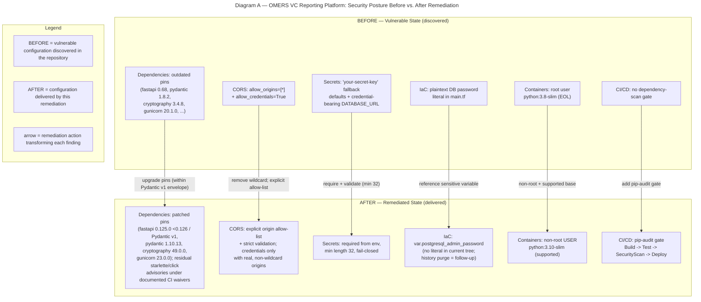

# Security Policy

The **OMERS Ventures Backend Platform** is a Python/FastAPI microservices system that manages financial reporting metrics for OMERS Ventures' portfolio companies on Microsoft Azure (see the [project README](README.md) for a component overview). This document defines the platform's security policy and coordinated-disclosure process, and summarizes the security-remediation engagement carried out against the codebase, including advisories that remain under documented CI waivers and pre-existing defects that are out of scope and remain open (see [Known Issues and Deferred Items](#known-issues-and-deferred-items)). The full rationale for every remediation decision is maintained separately in the [security decision log](docs/security/decision-log.md).

## Supported Versions

This repository does not follow a formal versioning scheme. Security updates are applied to the latest `main` line only; older commits and forks are not maintained.

| Version | Supported |
|---------|-----------|
| `main` (latest) | :white_check_mark: |
| Older commits / forks | :x: |

## Reporting a Vulnerability

We take the security of the OMERS Ventures Backend Platform seriously and welcome coordinated, private disclosure of security issues.

- **Where to report:** Email the maintainers privately at **`security@omersventures.com`**. *This address is a placeholder and must be confirmed by the repository maintainers before it is relied upon.* Please do **not** open a public GitHub issue or pull request for an undisclosed vulnerability.
- **What to include:**
  - The affected service and/or file path (for example, `src/backend/api_gateway/config.py`).
  - Clear, step-by-step reproduction instructions.
  - The impact you have observed or believe is possible (confidentiality, integrity, and/or availability).
  - Any relevant logs, request/response captures, or proof-of-concept material, with secrets redacted.
- **Acknowledgement window:** We aim to acknowledge a report within **3 business days** and will keep you informed of remediation progress.
- **Coordinated disclosure:** Please do not publicly disclose the issue until a fix has been released and coordinated disclosure has been agreed with the maintainers.

## Disclosure Handling

Incoming reports are triaged by severity — **Critical / High / Medium / Low** — based on exploitability and impact. Each confirmed finding is remediated with the **least-invasive fix** that fully closes the issue while preserving existing functionality, consistent with the Minimal Change Clause that governed the remediation summarized below.

## Security Remediation Summary

An authoritative discovery pass — combining the OSV.dev advisory database with a manual audit of code, configuration, and infrastructure-as-code — surfaced **72 advisory findings across 16 vulnerable pinned packages**, plus **four non-dependency findings** (permissive CORS, weak fallback secrets, a hard-coded Terraform database credential, and container-hardening gaps). These findings were addressed with minimal, targeted changes that preserve existing functionality and workflows, with two documented exceptions: advisories whose only fix would breach the frozen compatibility envelope (notably `starlette`, held below 0.51 by the FastAPI `< 0.126` / Pydantic v1 ceiling) or whose fix is not installable on a service's runtime (`click` and `python-dotenv` on the Python 3.9 services), together with the AAP-deferred `pytest` and `loguru` advisories, remain under documented CI waivers rather than being cleared; and several pre-existing, out-of-scope defects — which block some service test suites from collecting — are retained for separately scoped work. Both categories are enumerated under [Known Issues and Deferred Items](#known-issues-and-deferred-items) below.

### Security Posture — Before vs. After Remediation

The diagram below contrasts the vulnerable state discovered in the repository with the remediated state actually delivered by this engagement, across all five layers. It reflects the true delivered state: dependency pins are patched but a small set of within-envelope-unfixable advisories remain under documented CI waivers (not a clean-slate "zero advisories" claim), and the former database credential is removed from the current tree while its history purge remains a follow-up.



### Dependency Upgrades

Vulnerable pins were raised to the minimal patched versions that clear each advisory. Clean dependencies were left unchanged.

| Package | Current | Patched To | CVE / Advisory | Severity |
|---------|---------|------------|----------------|----------|
| cryptography | 3.4.8 | 49.0.0 | CVE-2023-50782, CVE-2023-0286, CVE-2024-0727 (+ others) | Critical |
| gunicorn | 20.1.0 | 23.0.0 | CVE-2024-1135, CVE-2024-6827 | High |
| PyJWT | 2.3.0 | 2.13.0 | CVE-2022-29217 | High |
| requests | 2.26.0 / 2.27.1 / 2.31.0 | 2.34.2 (data-transformation function: 2.33.0) | CVE-2024-47081, CVE-2024-35195, CVE-2023-32681, PYSEC-2026-2275 | High |
| fastapi | 0.68.0 / 0.68.1 | 0.125.0 | CVE-2024-24762 | High |
| azure-identity | 1.7.0 | 1.16.1 | CVE-2024-35255 | High |
| pydantic | 1.8.2 | 1.10.13 | CVE-2024-3772 | Medium |
| httpx (test) | 0.18.2 | 0.27.0 | CVE-2021-41945 | Medium |
| python-dotenv | 0.19.0 / 0.19.2 | 1.2.2 (Python 3.10 services) / 1.0.1 (Python 3.9 services; PYSEC-2026-2270 waived — fix requires Python >= 3.10) | CVE-2026-28684 / PYSEC-2026-2270 | Low |

**Compatibility note:** Pydantic stays on the v1 line (preserves the `BaseSettings` API used throughout the codebase); FastAPI is capped `< 0.126.0` to retain Pydantic v1 support.

### Code & Configuration Fixes

- **CORS (CWE-942 / OWASP A05:2021):** Removed the `allow_origins=["*"]` + `allow_credentials=True` combination. Services now consume an explicit, operator-supplied origins allow-list; the API gateway environment-variable binding was corrected to `CORS_ALLOW_ORIGINS`; and the metrics-input service gained its previously missing `CORS_ORIGINS` setting.
- **Weak secrets (CWE-798 / CWE-259 / OWASP A02:2021 & A07:2021):** Removed the fallback defaults (`"your-secret-key"`, `"your-secret-key-here"`) and the credential-bearing default `DATABASE_URL`. Signing keys and database URLs are now required from the environment with a minimum-length guard (minimum 32 characters), mirroring the pattern already used by the authentication service and API gateway.
- **IaC credential (CWE-798):** Removed the plaintext PostgreSQL administrator password from `infrastructure/terraform/main.tf`; it now references the pre-declared sensitive variable `var.postgresql_admin_password`.
- **Container hardening (CWE-250):** The authentication and reporting-metrics Dockerfiles add a dedicated non-root `USER` and advance off the end-of-life `python:3.8-slim` base image to the supported `python:3.10-slim` (built images run as uid 1000).
- **CI/CD gate:** A `pip-audit` dependency-vulnerability scan stage was added to `infrastructure/azure-pipelines/azure-pipelines.yml` so future regressions are caught automatically.

### Security Verification

Dependency-vulnerability scan. In CI this runs per manifest on each service's actual runtime (Python 3.10 for `authentication_service`, `reporting_financials_service`, and `reporting_metrics_service`; Python 3.9 for `api_gateway` and `metrics_input_service`; Python 3.11 for the data-transformation function), with documented `--ignore-vuln` waivers for the advisories listed under [Known Issues and Deferred Items](#known-issues-and-deferred-items). The gate passes when **no un-waived advisory** remains — not that every advisory is cleared:

```bash
pip-audit -r src/backend/<service>/requirements.txt
```

Security and regression tests (per service; pytest does not enter watch mode). Run from the repository root so the tests' absolute `src.backend.*` imports resolve (running `python -m pytest` after `cd`-ing into a service directory removes the repository root from `sys.path` and errors at collection). Some suites currently fail to collect, or have pre-existing failures, because of the out-of-scope defects listed under [Known Issues and Deferred Items](#known-issues-and-deferred-items); those suites reference the specific blocker so it stays visible rather than passing silently:

```bash
python -m pytest src/backend/<service>/tests -v --tb=short
```

Infrastructure validation. Run against the full `infrastructure/terraform` directory, `terraform validate` currently **fails** on pre-existing undeclared-resource references in `outputs.tf` (unrelated to this engagement — see [Known Issues and Deferred Items](#known-issues-and-deferred-items)). The in-scope `main.tf` credential fix itself validates in isolation: copy `main.tf`, `backend.tf`, and `variables.tf` into an empty directory and run `terraform validate` there — it reports "Success! The configuration is valid." Separately, `terraform fmt -check` is a formatting-only check that reports pre-existing unformatted files (currently `backend.tf`) and returns a non-zero exit code; it is independent of `terraform validate`:

```bash
cd infrastructure/terraform
terraform validate          # currently fails: pre-existing undeclared-resource refs in outputs.tf (out of scope; see Known Issues)
terraform fmt -check        # non-zero if pre-existing files (e.g. backend.tf) are unformatted (formatting-only)

# The in-scope main.tf credential fix validates in isolation (excludes the pre-existing outputs.tf defect):
mkdir tf-isolation && cp main.tf backend.tf variables.tf tf-isolation/
cd tf-isolation && terraform init -backend=false && terraform validate   # Success! The configuration is valid.
```

Container non-root verification (expect a non-zero uid):

```bash
docker build -t svc . && docker run --rm svc id -u
```

Residual-secret scan (expect no matches). The former database-administrator password literal is intentionally **not** reproduced in this document (CWE-798); substitute the actual rotated value from your secret store when auditing, and see the credential-rotation follow-up under [Known Issues and Deferred Items](#known-issues-and-deferred-items):

```bash
# Removed weak-secret placeholder default (expect no matches):
grep -rn "your-secret-key" src infrastructure
# Former plaintext DB admin password — substitute the actual rotated literal from
# your secret store for <former-db-admin-password> (expect no matches):
grep -rn "<former-db-admin-password>" src infrastructure
```

## Known Issues and Deferred Items

This section discloses the advisories and defects that remain open after the engagement, so the remediation summary above is not read as a clean-slate claim.

**Advisories retained under documented CI `--ignore-vuln` waivers.** Each is recorded explicitly in the pipeline; its only fix would either breach the frozen compatibility envelope or is not installable on the affected service's runtime:

- **`starlette`** (PYSEC-2026-161, -248, -249, -2280, -2281) — the fix requires FastAPI `>= 0.126`, which drops Pydantic v1; `starlette` is therefore held below 0.51 by the compatibility ceiling.
- **`click`** (PYSEC-2026-2132) — on the Python 3.9 services (`api_gateway`, `metrics_input_service`) only; the fix requires Python `>= 3.10`.
- **`python-dotenv`** (PYSEC-2026-2270) — on the Python 3.9 services (`api_gateway`, `metrics_input_service`) only; the fix (`python-dotenv` 1.2.2) requires Python `>= 3.10`. The three Python 3.10 services (`authentication_service`, `reporting_financials_service`, `reporting_metrics_service`) pin the patched `1.2.2`, so the advisory is cleared there rather than waived.
- **`pytest`** (PYSEC-2026-1845) and **`loguru`** (PYSEC-2022-14) — AAP-deferred (see the follow-ups below).

**Pre-existing, out-of-scope defects that affect some checks.** These are retained for separately scoped work. The security-regression suites are written to stay meaningful despite them — either by degrading gracefully or by exercising the settings class directly — so they pass rather than passing silently or masking the blocker:

- The reporting-financials application module misuses `Config.DATABASE_URL` (a Pydantic v1 class-attribute access that raises `AttributeError`), so importing the full application fails and its full-application test (`tests/test_financials.py`) does not collect. Its security regression suites (`tests/test_security_config.py`, `tests/test_security_cors.py`) pass, because they exercise the `Config` settings class and the CORS application factory directly.
- The reporting-metrics application imports `UUID` from `sqlalchemy` at the top level, which the pinned SQLAlchemy 1.4.x does not expose (`ImportError`), so its full-application test (`tests/test_metrics.py`) does not collect; its `tests/test_security_config.py` suite passes by exercising the `Settings` class directly.
- The metrics-input application package now imports cleanly (the stray `app/__init__.py` syntax fragment and the `config` ↔ `app.routers.metrics` circular import have been removed), so the full application builds via `main.create_app`. Its CORS regression suite binds the live `CORSMiddleware` through `main.create_app` (and also exercises the `config.py` origin validator directly), and its full `tests/` suite passes (15 passed; 2 async cases skipped for lack of an async plugin).
- The `terraform validate` verification step above currently fails on pre-existing undeclared-resource references in `infrastructure/terraform/outputs.tf` (its resource names do not match those declared in `main.tf`) and on cross-provider resources that are never declared. The `main.tf` credential fix itself validates in isolation (with `backend.tf` and `variables.tf`); the broader Terraform-layer consistency is separately scoped work.

**Pre-existing release-blockers requiring separately authorized architectural work.** These defects were present in the codebase before this engagement (confirmed against the committed baseline) and are not attributable to the security-remediation diff. Their fixes fall outside the security-fix scope — the AAP restricts this engagement to the enumerated vulnerability classes and explicitly defers the architectural authentication rework (per the scope boundaries in AAP §0.8). They are recorded here so the delivery gate is not read as a clean-slate claim:

- **API-gateway authentication contract (CRITICAL).** The gateway's `get_current_user` applies `validate_token` twice (once as a `Depends(...)` dependency, once directly), the token is bound as a query dependency rather than an `Authorization` header, and the request middleware indexes `Authorization.split(" ")[1]` (so a header without a space raises and surfaces as a 500). The net effect is inconsistent 401/422/500 behavior for valid and malformed clients. This logic is pre-existing (present in `api_gateway/main.py` and `app/__init__.py` at the committed baseline and unmodified by this engagement); the security-event logging added here wraps the existing flow without changing its decode count or status semantics. The correct fix — a single OAuth2 bearer dependency and one fail-closed validation path with header-shape validation — is the architectural authentication rework the AAP defers (§0.8), and is out of scope here.
- **Hardened container default startup (CRITICAL).** The authentication and reporting-metrics images build and run as a non-root UID (1000) — the container-hardening objective in scope for this engagement (non-root user + supported base image, verified with `id -u`) is met. However, a default `docker run` exits non-zero with `No module named src` because the images are built with the service directory as the build context (`COPY . .`) while the application uses absolute `src.backend.*` imports. This is a pre-existing namespace-packaging/build-context mismatch (the Dockerfiles are unmodified by this engagement); packaging the namespace correctly for the documented build context is beyond the in-scope container-hardening change (AAP §0.8.1 scopes container work to non-root + base image; §0.7 verifies via `id -u`, not full-app startup) — follow-up.
- **Business-router authentication/authorization (CRITICAL, pre-existing).** Business routers use database dependencies without application-level authentication/authorization, and the auth/gateway token endpoints accept username/password/JWT values as query-string parameters (leaking secrets via URLs, logs, and history). No demonstrated 403 path exists. This is pre-existing and belongs to the architectural authentication rework the AAP defers (§0.8); adding authenticated/authorized dependencies and moving credentials/tokens into request bodies or `Authorization` headers is separately authorized work — follow-up.
- **Required signing secrets are not yet consumed by a runtime JWT path (MAJOR).** The reporting-financials `JWT_SECRET_KEY` and reporting-metrics `SECRET_KEY` are now required-from-environment with a minimum-length guard (the AAP-mandated weak-secret remediation, §0.5.3), which fails closed on misconfiguration. However, those two services do not currently wire a runtime JWT verification path that consumes these secrets — so the fields harden configuration (no predictable default) but do not by themselves prove request-time token protection. The onboarding docs have been corrected to describe them accurately rather than claim runtime JWT protection; wiring them into an authenticated flow is part of the deferred authentication rework (tied to the business-router item above) — follow-up.
- **Router error/privacy leakage (MAJOR, pre-existing).** Several routers (metrics-input, reporting-metrics, reporting-financials) return internal exception text to clients and can log full request URLs. This is pre-existing and not attributable to the security-remediation diff; returning generic client errors while logging sanitized structured diagnostics is separately authorized work — follow-up.
- **Alternate auth application factory swallows a router import failure (MAJOR, pre-existing).** The authentication service's `app/__init__.py` builds a module-level app that wraps its router import in `try/except ImportError` and only prints a message, so a genuine router failure would yield a docs-only app with empty `on_event` startup/shutdown handlers. This `try/except`-and-`print` pattern and the empty lifecycle handlers are pre-existing (present verbatim at the committed baseline); the security-remediation diff to this file is limited to the AAP-authorized CORS allow-list wiring and correlation-id/CORS security-event logging (§0.5.1–0.5.2), and does not change the import-failure semantics. The production entrypoint is `main:app` (the container's `uvicorn main:app`), whose `create_app()` includes the routers directly and is unaffected by this alternate factory. Making the alternate factory fail-closed or equivalent to `main.create_app()` is a functional/startup-behavior change outside the five in-scope security layers and the Minimal Change Clause (AAP §0.8) — follow-up.
- **Static-analysis and lifecycle-hook items (INFO, pre-existing).** Mypy flags `Optional` environment values assigned to `str` (reporting config), and FastAPI's deprecated `on_event` lifecycle hook is still used (auth app). These are pre-existing and non-blocking relative to the items above; correcting the typing and migrating to lifespan handlers should happen when those modules are next authorized — follow-up.

**Deferred follow-ups** — outside the scope of this security-remediation engagement and recorded here as recommended next steps; they are **not** addressed by the changes summarized above:

- **Former database-administrator credential rotation and history purge (CWE-798)** — the plaintext password was removed from the current tracked tree (Terraform now references `var.postgresql_admin_password`, and it is not reproduced in any documentation), but it remains present in prior Git history. Rotate/revoke the credential at the database and provision the new value as a pipeline secret, then perform an approved Git-history/secret-scanner remediation (for example a coordinated history rewrite) — a one-time operational step outside this engagement.
- **`pytest` 6.x → 9.x** (test-only; local symlink attack vector) — deferred; the three-major-version jump risks breaking the existing test suite.
- **`loguru` advisory** — informational and Windows-specific — deferred.
- **End-of-life PostgreSQL v11 engine version** — follow-up.
- **Hard-coded placeholder demo credentials (`testuser` / `testpassword`)** — belong to an architectural authentication rework — follow-up.
- **Mis-wired CI Test-stage paths and the missing root Dockerfile referenced by the pipeline** — follow-up.
- **`data_transformation` function runtime alignment** — the function manifest pins patched `requests` / `urllib3` that require Python `>= 3.10`, while the function app's deploy runtime in `infrastructure/terraform/main.tf` is `PYTHON|3.9` (its pre-existing baseline value; the unrelated runtime bump was reverted under the Minimal Change Clause). Aligning the deploy runtime to `>= 3.10`, or pinning `requests==2.32.4` (Python 3.8-compatible, the AAP target) instead, so these pins install at deploy time — follow-up.
- **Broad observability build-out** (distributed tracing, Prometheus metrics wiring, Application Insights integration) — beyond the security-event logging added in this engagement — follow-up.
- **No dependency lockfiles exist** — the manifests pin only top-level packages, so transitive versions float; introducing lockfiles is a recommended follow-up.
- **Masked pipeline-secret → `TF_VAR_postgresql_admin_password` mapping** — the plaintext database password is removed from source and must be supplied at apply time via the sensitive `postgresql_admin_password` variable (see [`infrastructure/README.md`](infrastructure/README.md)). The `backend-secrets` variable group is linked in `azure-pipelines.yml`, but the pipeline's `Deploy` stage ships to AKS via the `Kubernetes@1` task and does not invoke Terraform, so no job maps a masked secret into `TF_VAR_postgresql_admin_password` today. Wiring that masked mapping into an authorized Terraform-apply/deploy job is a deployment-coordination follow-up.
- **Hardened-container application boot (packaging)** — the two hardened service Dockerfiles copy only the service subdirectory (`COPY . .`) while the application imports via repository-root-absolute `src.backend.*` paths, so a built image cannot resolve the `src` package at startup (`ModuleNotFoundError: No module named 'src'`). The container-hardening change itself (non-root `USER` + supported base image) is correct and independent of this pre-existing packaging gap; packaging the `src` tree into the image (or installing the package) is a follow-up.
- **Outbound FX-rate request timeout** — the data-transformation function's outbound `requests.get(...)` call (`src/functions/data_transformation/main.py`) has no request timeout, so a slow upstream can hang the call (mitigated in production only by the Azure Functions platform timeout). The `requests` dependency was upgraded to a patched release in this engagement; adding an explicit `timeout=(connect, read)` remains a follow-up.
- **Unbounded list queries and latent N+1 in the reporting services** — the reporting list endpoints use unbounded `query.all()` (no limit/offset) and return raw SQLAlchemy models via `response_model` over lazy relationships; these become relevant once the pre-existing import defects above are repaired, at which point pagination and dedicated response schemas are a recommended follow-up.

## Rationale and Decision Log

The full rationale, the alternatives considered, and the residual risk for every non-trivial remediation decision are recorded in [`docs/security/decision-log.md`](docs/security/decision-log.md), which is the single source of truth for that rationale. Code comments were kept minimal and factual (naming the control and its CVE/CWE identifier); the explanatory detail lives solely in the decision log.

## Standards

Mappings applied: **OWASP Top 10** — A02:2021 (Cryptographic Failures), A05:2021 (Security Misconfiguration), A06:2021 (Vulnerable and Outdated Components), and A07:2021 (Identification and Authentication Failures); and **CWE** — CWE-942 (Overly Permissive CORS), CWE-798 (Use of Hard-coded Credentials), CWE-259 (Use of Hard-coded Password), and CWE-250 (Execution with Unnecessary Privileges).
