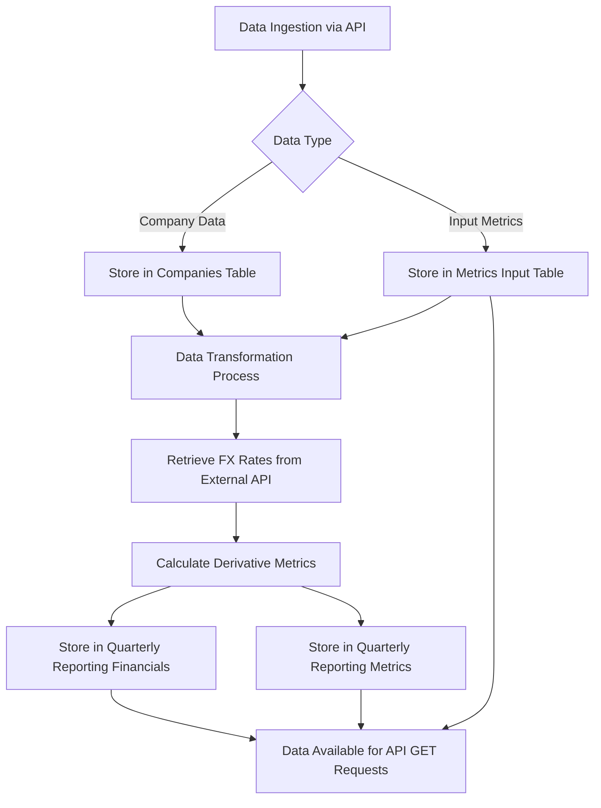
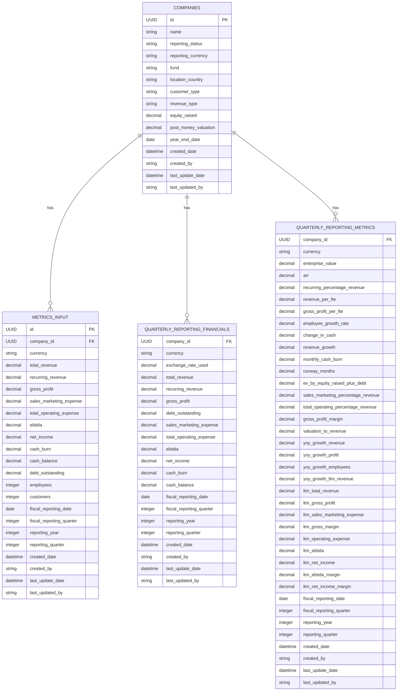
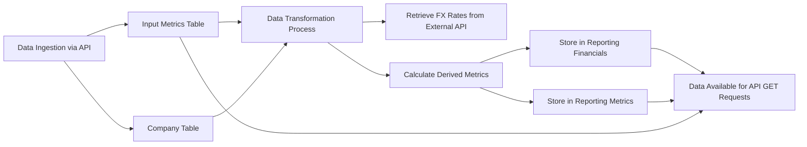

# Introduction

## Purpose

The purpose of this Software Requirements Specification (SRS) document is to provide a comprehensive and detailed description of the backend platform designed to store and retrieve financial reporting metrics from companies in which OMERS Ventures has invested. This document serves as a guide for developers, project managers, stakeholders, and any other parties involved in the development and maintenance of the platform. It outlines the functional and non-functional requirements, ensuring that all parties have a clear and unified understanding of the system’s objectives, capabilities, and constraints.

## Scope

The backend platform aims to facilitate the efficient management of financial reporting metrics from portfolio companies of OMERS Ventures. The core functionalities of the platform include:

- **Data Storage:** Utilizing a PostgreSQL database to store quarterly reporting metrics across four primary tables: Companies, Metrics Input, Quarterly Reporting Financials, and Quarterly Reporting Metrics.
- **API Services:** Implementing a FastAPI-based REST API to enable the addition and retrieval of data from the database, ensuring seamless integration with other systems and user interfaces.
- **Data Transformation:** Developing a robust data transformation process that retrieves foreign exchange rates from an external API and calculates derivative metrics from the input data, storing the results in the appropriate reporting and metrics tables.
- **Technology Stack:** Leveraging standard Azure products for hosting, ensuring scalability, reliability, and security of the platform.
- **Derivative Metrics Calculation:** Automatically calculating and storing financial metrics in multiple currencies upon the upload of new input metrics files, based on predefined formulas.

### Goals

- **Centralized Data Management:** Provide a unified repository for all financial metrics related to portfolio companies, enhancing data accessibility and integrity.
- **Automated Processing:** Streamline data transformation and metric calculations to reduce manual intervention and minimize errors.
- **Scalability and Flexibility:** Design the system to accommodate future growth in the number of portfolio companies and the volume of data.
- **Security and Compliance:** Ensure that all data is stored securely, adhering to relevant financial and data protection regulations.

### Benefits

- **Enhanced Decision-Making:** Enable OMERS Ventures to make informed investment decisions based on accurate and up-to-date financial metrics.
- **Operational Efficiency:** Reduce the time and effort required to collect, process, and analyze financial data from portfolio companies.
- **Data Consistency:** Maintain consistent data formats and standards across all financial metrics, facilitating easier comparison and analysis.
- **Integration Capability:** Provide a robust API that allows easy integration with other tools and platforms used by OMERS Ventures.

### Core Functionalities

- **Database Management:** Structured storage of company information and financial metrics with clearly defined relationships and constraints.
- **API Operations:** Support for GET and POST operations to facilitate data retrieval and insertion, with endpoints tailored to specific data tables.
- **Data Transformation Services:** Automated retrieval of external data (e.g., FX rates) and computation of derived metrics to enrich the stored data.
- **User Management:** Ability to track record creation and updates, ensuring accountability and traceability of data modifications.

This platform is essential for OMERS Ventures to effectively monitor and analyze the performance of its investments, ensuring that strategic decisions are backed by reliable and comprehensive financial data.

# Product Description

## Product Perspective

The backend platform operates as a centralized data repository within OMERS Ventures' technology ecosystem. It integrates seamlessly with existing systems through a FastAPI-based REST API, allowing data ingestion and retrieval from various internal tools and user interfaces. The platform is hosted on standard Azure products, ensuring scalability, reliability, and security consistent with OMERS Ventures' infrastructure standards. It interacts with external services for retrieving foreign exchange rates necessary for data transformation processes. The platform’s PostgreSQL database serves as the foundation for storing structured quarterly financial metrics, supporting the organization's objectives of efficient data management and analysis.

## Product Functions

- **Data Storage and Management:**
  - Structured storage of company information and financial metrics in a PostgreSQL database comprising four main tables: Companies, Metrics Input, Quarterly Reporting Financials, and Quarterly Reporting Metrics.
  - Maintenance of data integrity through defined relationships and constraints between tables.

- **API Services:**
  - Implementation of FastAPI-based RESTful endpoints to facilitate the addition (POST) and retrieval (GET) of data.
  - Support for querying data based on company identifiers and reporting timeframes.

- **Data Transformation and Derivative Metrics Calculation:**
  - Automated retrieval of foreign exchange rates from external API services.
  - Calculation of derived financial metrics from input data using predefined formulas.
  - Storage of transformed and calculated metrics in multiple currencies within the reporting and metrics tables.

- **User Management:**
  - Tracking of record creation and updates to ensure accountability and traceability.
  - Management of user permissions and access controls for interacting with the platform.

- **Integration and Scalability:**
  - Ability to integrate with other internal and external systems through robust API endpoints.
  - Design accommodates future growth in the number of portfolio companies and data volume.

## User Characteristics

The backend platform is intended for use by the following user groups:

- **Developers:**
  - **Expertise Level:** Advanced
  - **Responsibilities:** Implementing, maintaining, and extending the backend platform, ensuring seamless integration with other systems.

- **Data Analysts and Financial Analysts:**
  - **Expertise Level:** Intermediate to Advanced
  - **Responsibilities:** Accessing and analyzing financial metrics to support investment decision-making processes.

- **OMERS Ventures Staff:**
  - **Expertise Level:** Basic to Intermediate
  - **Responsibilities:** Managing portfolio companies' data, monitoring reporting statuses, and utilizing APIs for data retrieval and submission.

- **System Administrators:**
  - **Expertise Level:** Advanced
  - **Responsibilities:** Managing the deployment environment on Azure, ensuring system security, and overseeing database performance.

## Constraints

- **Technology Stack:**
  - Must utilize PostgreSQL for the database, FastAPI for the REST API services, and Azure for hosting and infrastructure.

- **Compliance and Security:**
  - Adherence to financial data protection regulations and internal security policies.
  - Implementation of secure authentication and authorization mechanisms to protect sensitive data.

- **Performance:**
  - The platform must handle concurrent data requests and transformations efficiently to provide timely access to financial metrics.

- **Budgetary Limitations:**
  - Development and maintenance must remain within the allocated budget for the project, leveraging existing Azure resources where possible.

- **Data Consistency:**
  - Ensuring consistency and accuracy of financial metrics across multiple currencies and reporting periods.

## Assumptions and Dependencies

- **Assumptions:**
  - Portfolio companies will provide accurate and timely quarterly financial metrics.
  - The external API service for foreign exchange rates will be reliable and accessible.
  - Users accessing the platform will have the necessary permissions and credentials.

- **Dependencies:**
  - Reliance on external services for retrieving up-to-date foreign exchange rates.
  - Dependency on Azure services for hosting, scalability, and infrastructure support.
  - Dependent on the availability and accuracy of data provided by portfolio companies.
  - Integration with other internal systems via the REST API for data exchange and functionality extension.

## PROCESS FLOWCHART

# Functional Requirements

## Feature 1: Company Data Management

### ID

FR-1

### DESCRIPTION

Manage the storage, retrieval, and maintenance of company information within the Companies table in the PostgreSQL database.

### PRIORITY

High

### TABLE OF FUNCTIONAL REQUIREMENTS

| Functional Requirement ID | Description                                                            |
|---------------------------|------------------------------------------------------------------------|
| FR-1.1                    | The system shall allow adding new company records to the Companies table. |
| FR-1.2                    | The system shall allow updating existing company records in the Companies table. |
| FR-1.3                    | The system shall ensure each company has a unique UUID as the `id`.     |
| FR-1.4                    | The system shall validate data fields according to the Companies table structure. |
| FR-1.5                    | The system shall prevent deletion of company records to maintain data integrity. |
| FR-1.6                    | The system shall retrieve company information based on `company_id`.    |

## Feature 2: Metrics Input Management

### ID

FR-2

### DESCRIPTION

Handle the storage, retrieval, and management of input financial metrics submitted by portfolio companies.

### PRIORITY

High

### TABLE OF FUNCTIONAL REQUIREMENTS

| Functional Requirement ID | Description                                                            |
|---------------------------|------------------------------------------------------------------------|
| FR-2.1                    | The system shall allow adding new input metrics to the Metrics Input table. |
| FR-2.2                    | The system shall allow updating existing input metrics in the Metrics Input table. |
| FR-2.3                    | The system shall associate input metrics with the correct `company_id`. |
| FR-2.4                    | The system shall validate input metrics data according to the Metrics Input table structure. |
| FR-2.5                    | The system shall prevent deletion of input metrics records to maintain data integrity. |
| FR-2.6                    | The system shall retrieve input metrics based on `company_id` and reporting date range. |

## Feature 3: Quarterly Financials Management

### ID

FR-3

### DESCRIPTION

Manage the storage and retrieval of quarterly financial metrics adjusted to multiple currencies in the Quarterly Reporting Financials table.

### PRIORITY

Medium

### TABLE OF FUNCTIONAL REQUIREMENTS

| Functional Requirement ID | Description                                                            |
|---------------------------|------------------------------------------------------------------------|
| FR-3.1                    | The system shall store currency-adjusted quarterly financial metrics.  |
| FR-3.2                    | The system shall retrieve quarterly financials based on `company_id` and reporting period. |
| FR-3.3                    | The system shall ensure foreign exchange rates are accurately applied during data transformation. |
| FR-3.4                    | The system shall validate financial data according to the Quarterly Reporting Financials table structure. |
| FR-3.5                    | The system shall maintain audit trails for created and updated financial records. |

## Feature 4: Quarterly Metrics Management

### ID

FR-4

### DESCRIPTION

Handle the calculation, storage, and retrieval of derived financial metrics in the Quarterly Reporting Metrics table.

### PRIORITY

High

### TABLE OF FUNCTIONAL REQUIREMENTS

| Functional Requirement ID | Description                                                            |
|---------------------------|------------------------------------------------------------------------|
| FR-4.1                    | The system shall automatically calculate derived metrics from input data. |
| FR-4.2                    | The system shall store calculated metrics in multiple currencies.     |
| FR-4.3                    | The system shall retrieve derived metrics based on `company_id` and reporting period. |
| FR-4.4                    | The system shall validate derived metrics calculations as per defined formulas. |
| FR-4.5                    | The system shall ensure consistency and accuracy of derived metrics across reporting periods. |

## Feature 5: API Data Retrieval

### ID

FR-5

### DESCRIPTION

Provide RESTful API endpoints to enable retrieval of data from various database tables based on specific parameters.

### PRIORITY

High

### TABLE OF FUNCTIONAL REQUIREMENTS

| Functional Requirement ID | Description                                                            |
|---------------------------|------------------------------------------------------------------------|
| FR-5.1                    | The system shall provide GET endpoints for input metrics, reporting financials, and reporting metrics. |
| FR-5.2                    | The system shall require `company_id` and reporting date range as URL parameters for GET requests. |
| FR-5.3                    | The system shall return data in a structured JSON format upon successful GET requests. |
| FR-5.4                    | The system shall handle error responses for invalid or missing parameters in GET requests. |
| FR-5.5                    | The system shall support pagination for GET requests returning large datasets. |

## Feature 6: API Data Submission

### ID

FR-6

### DESCRIPTION

Provide RESTful API endpoints to enable submission and updating of data to various database tables.

### PRIORITY

High

### TABLE OF FUNCTIONAL REQUIREMENTS

| Functional Requirement ID | Description                                                            |
|---------------------------|------------------------------------------------------------------------|
| FR-6.1                    | The system shall provide POST endpoints for input metrics and company data. |
| FR-6.2                    | The system shall allow creation of new records or updating existing records based on `company_id`. |
| FR-6.3                    | The system shall validate incoming data according to the respective table structures before insertion or update. |
| FR-6.4                    | The system shall return appropriate success or error responses based on the outcome of POST requests. |
| FR-6.5                    | The system shall log information about who created or updated a record via API submissions. |

## Feature 7: Data Transformation and Metrics Calculation

### ID

FR-7

### DESCRIPTION

Automate the retrieval of foreign exchange rates and the calculation of derived financial metrics from input data.

### PRIORITY

Medium

### TABLE OF FUNCTIONAL REQUIREMENTS

| Functional Requirement ID | Description                                                            |
|---------------------------|------------------------------------------------------------------------|
| FR-7.1                    | The system shall retrieve current foreign exchange rates from an external API service. |
| FR-7.2                    | The system shall apply retrieved exchange rates to convert input metrics into multiple currencies. |
| FR-7.3                    | The system shall calculate derivative metrics using predefined formulas upon data ingestion. |
| FR-7.4                    | The system shall store transformed and calculated metrics in the appropriate reporting tables. |
| FR-7.5                    | The system shall handle and log errors encountered during data transformation processes. |
| FR-7.6                    | The system shall ensure data transformation processes are triggered automatically upon new data uploads. |

## Feature 8: User Management and Permissions

### ID

FR-8

### DESCRIPTION

Manage user access, permissions, and track record creation and updates to ensure accountability and data integrity.

### PRIORITY

High

### TABLE OF FUNCTIONAL REQUIREMENTS

| Functional Requirement ID | Description                                                            |
|---------------------------|------------------------------------------------------------------------|
| FR-8.1                    | The system shall authenticate users before granting access to the platform. |
| FR-8.2                    | The system shall authorize users based on predefined roles and permissions. |
| FR-8.3                    | The system shall track and record the creation and last update details for each record, including `created_by` and `last_updated_by`. |
| FR-8.4                    | The system shall allow administrators to manage user roles and permissions through a secure interface. |
| FR-8.5                    | The system shall log all user activities related to data modifications for audit purposes. |
| FR-8.6                    | The system shall enforce password policies and secure authentication mechanisms to protect user accounts. |

## Feature 9: Integration and Scalability

### ID

FR-9

### DESCRIPTION

Ensure the backend platform can integrate with other systems and scale to accommodate future growth in data and user load.

### PRIORITY

Medium

### TABLE OF FUNCTIONAL REQUIREMENTS

| Functional Requirement ID | Description                                                            |
|---------------------------|------------------------------------------------------------------------|
| FR-9.1                    | The system shall provide robust API endpoints for integration with internal and external systems. |
| FR-9.2                    | The system shall support horizontal scaling on Azure to handle increasing data volume and user requests. |
| FR-9.3                    | The system shall monitor and manage API usage to prevent bottlenecks and ensure high availability. |
| FR-9.4                    | The system shall implement load balancing to distribute incoming traffic efficiently. |
| FR-9.5                    | The system shall maintain performance standards as the number of portfolio companies grows. |
| FR-9.6                    | The system shall support automated deployment pipelines for seamless updates and scalability. |

## Feature 10: Data Security and Compliance

### ID

FR-10

### DESCRIPTION

Ensure that all data is stored securely and that the platform adheres to relevant financial and data protection regulations.

### PRIORITY

High

### TABLE OF FUNCTIONAL REQUIREMENTS

| Functional Requirement ID | Description                                                            |
|---------------------------|------------------------------------------------------------------------|
| FR-10.1                   | The system shall encrypt sensitive data both at rest and in transit.  |
| FR-10.2                   | The system shall comply with financial data protection regulations applicable to OMERS Ventures. |
| FR-10.3                   | The system shall implement secure authentication and authorization mechanisms. |
| FR-10.4                   | The system shall regularly update and patch software components to protect against vulnerabilities. |
| FR-10.5                   | The system shall perform regular security audits and assessments.     |
| FR-10.6                   | The system shall provide data access logs and monitoring to detect and respond to unauthorized access attempts. |

## Feature 11: Performance and Reliability

### ID

FR-11

### DESCRIPTION

Ensure the backend platform performs efficiently under expected load and maintains high availability and reliability.

### PRIORITY

Medium

### TABLE OF FUNCTIONAL REQUIREMENTS

| Functional Requirement ID | Description                                                            |
|---------------------------|------------------------------------------------------------------------|
| FR-11.1                   | The system shall handle concurrent data requests without performance degradation. |
| FR-11.2                   | The system shall achieve response times for API requests within acceptable limits (e.g., < 200ms). |
| FR-11.3                   | The system shall ensure 99.9% uptime for all critical services.       |
| FR-11.4                   | The system shall implement automatic failover mechanisms in Azure to ensure continuous availability. |
| FR-11.5                   | The system shall perform regular backups of the PostgreSQL database to prevent data loss. |
| FR-11.6                   | The system shall monitor performance metrics and alert administrators of any anomalies. |

# Non-Functional Requirements

## Performance

- **Response Time:**
  - The system shall ensure that all API GET and POST requests have a response time of less than 200 milliseconds under normal operating conditions.
  
- **Throughput:**
  - The system shall support a minimum of 100 concurrent API requests per second without performance degradation.
  
- **Resource Usage:**
  - The backend services shall utilize no more than 70% of CPU and 80% of memory resources on Azure hosting instances under peak load conditions.
  
- **Scalability:**
  - The system shall be capable of scaling horizontally to handle increased load, with the ability to add additional instances seamlessly through Azure’s autoscaling features.
  
- **Latency:**
  - Data transformation processes, including the retrieval of foreign exchange rates and calculation of derivative metrics, shall complete within 5 seconds after the upload of new input metrics files.
  
- **Database Performance:**
  - PostgreSQL queries for data retrieval and insertion shall execute with an average latency of less than 100 milliseconds.

## Safety

- **Data Integrity:**
  - The system shall implement transactional operations in the PostgreSQL database to ensure that data is not corrupted in the event of a failure during data processing.
  
- **Redundancy:**
  - The backend platform shall utilize Azure’s built-in redundancy features to ensure continuous operation in case of hardware failures or data center outages.
  
- **Backup and Recovery:**
  - The system shall perform automated daily backups of the PostgreSQL database, with the ability to restore data to any point within the last 30 days.
  
- **Failover Mechanisms:**
  - The system shall implement automatic failover to standby instances in Azure to minimize downtime during unexpected failures.
  
- **Disaster Recovery:**
  - A disaster recovery plan shall be in place, with regular testing to ensure the platform can be restored within 4 hours of a major incident.

## Security

- **Authentication:**
  - The system shall implement OAuth 2.0 for secure user authentication to ensure that only authorized users can access the platform.
  
- **Authorization:**
  - Role-Based Access Control (RBAC) shall be enforced, ensuring users can only perform actions and access data according to their assigned roles.
  
- **Data Encryption:**
  - All sensitive data shall be encrypted at rest using AES-256 encryption.
  - Data in transit shall be secured using TLS 1.2 or higher.
  
- **Privacy:**
  - The system shall comply with data privacy standards, ensuring that personal and sensitive information is handled in accordance with applicable laws and regulations.
  
- **Audit Logging:**
  - All user activities related to data access and modifications shall be logged with timestamps and user identifiers for audit purposes.
  
- **Vulnerability Management:**
  - The system shall undergo regular security assessments and vulnerability scans, with timely remediation of identified issues.
  
- **Security Incident Response:**
  - A security incident response plan shall be established to detect, respond to, and recover from security breaches promptly.

## Quality

- **Availability:**
  - The backend platform shall achieve an uptime of 99.9%, ensuring high availability for users and systems dependent on it.
  
- **Maintainability:**
  - The system shall adhere to modular design principles, allowing for easy updates and maintenance.
  - Codebase shall follow industry-standard coding practices and be documented thoroughly to facilitate maintenance and onboarding.
  
- **Usability:**
  - The API endpoints shall be well-documented using tools like Swagger, providing clear guidelines for developers to integrate and utilize the services effectively.
  
- **Scalability:**
  - The platform shall be designed to accommodate future growth in the number of portfolio companies and the volume of data without significant performance impacts.
  
- **Reliability:**
  - The system shall implement robust error handling and retry mechanisms to ensure reliability in data processing and API interactions.
  - Automated monitoring and alerting shall be in place to detect and address issues proactively.

## Compliance

- **Regulatory Compliance:**
  - The system shall comply with applicable financial data protection regulations, including but not limited to GDPR and CCPA, ensuring that personal and financial data is handled according to legal standards.
  
- **Industry Standards:**
  - The platform shall adhere to industry best practices and standards, such as ISO/IEC 27001 for information security management.
  
- **Data Protection:**
  - The system shall ensure compliance with OMERS Ventures’ internal data protection policies and procedures.
  
- **Audit Requirements:**
  - The system shall support audit trails and reporting features to facilitate compliance audits and reviews.
  
- **Third-Party Compliance:**
  - Any external APIs or services integrated into the platform shall be selected based on their compliance with relevant security and privacy standards.
  
- **Documentation:**
  - Comprehensive documentation shall be maintained to demonstrate compliance with all relevant legal, regulatory, and standards requirements.

# Data Requirements

## Data Models

### Entity Relationship Diagram

## Data Storage

### Database

- **Type:** PostgreSQL
- **Hosting:** Azure Database for PostgreSQL
- **Tables:**
  - **Companies Table**
  - **Metrics Input Table**
  - **Quarterly Reporting Financials Table**
  - **Quarterly Reporting Metrics Table**

### Data Retention

- **Retention Policy:** 
  - All financial data will be retained indefinitely to support long-term analysis and reporting requirements.
  - Historical data will be archived periodically to optimize database performance, with archived data maintained in separate storage if necessary.

### Redundancy

- **Azure Redundancy Features:**
  - **High Availability:** Utilizes Azure’s High Availability configurations to ensure continuous operation.
  - **Geo-Redundancy:** Data is replicated across multiple Azure regions to protect against regional outages.

### Backup and Recovery

- **Automated Backups:**
  - **Frequency:** Daily automated backups.
  - **Retention:** Retain backups for 30 days.
- **Point-in-Time Restore:**
  - Ability to restore the database to any point within the last 30 days in case of data corruption or accidental deletions.
- **Disaster Recovery:**
  - **Recovery Time Objective (RTO):** 4 hours.
  - **Recovery Point Objective (RPO):** 24 hours.
- **Backup Storage:**
  - Backups are stored in Azure Blob Storage with encryption at rest.

## Data Processing

### Data Security

- **Encryption:**
  - **Data at Rest:** AES-256 encryption for all sensitive data stored in the PostgreSQL database.
  - **Data in Transit:** TLS 1.2 or higher for all data transmitted between the API services and the database.
- **Authentication and Authorization:**
  - **Authentication:** OAuth 2.0 for secure user authentication.
  - **Authorization:** Role-Based Access Control (RBAC) to enforce permissions based on user roles.
- **Access Controls:**
  - Least privilege principle applied to all database users and services.
  - Regular audits of access logs to detect and respond to unauthorized access attempts.

### Data Flow Diagram

### Data Transformation

- **Process Automation:**
  - Triggered automatically upon uploading new input metrics files.
- **Foreign Exchange Rates Retrieval:**
  - Retrieves current FX rates from an external API service.
- **Metric Calculations:**
  - Calculates derivative metrics using predefined formulas.
  - Stores calculated metrics in multiple currencies (Local, USD, CAD) in the respective reporting tables.
- **Error Handling:**
  - Logs and handles any errors encountered during data transformation processes to maintain data integrity.

### Data Integrity

- **Transactional Operations:**
  - Ensures atomicity of data operations to prevent partial updates.
- **Validation:**
  - Validates all incoming data against defined table structures before insertion or updates.
- **Audit Trails:**
  - Maintains audit trails for all data modifications, including creation and update details.

### Data Access

- **API Services:**
  - Provides RESTful endpoints for data retrieval (`GET`) and submission (`POST`).
- **Structured Responses:**
  - Ensures all API responses are in structured JSON format for consistency.
- **Pagination and Filtering:**
  - Supports pagination for large datasets to optimize performance.
  - Allows filtering based on `company_id`, reporting years, and quarters.

### Data Redundancy and Failover

- **Azure Features:**
  - Utilizes Azure’s automatic failover mechanisms to switch to standby instances in case of primary instance failures.
  - Implements load balancing to distribute incoming API requests effectively across multiple instances, ensuring high availability and reliability.

### Monitoring and Alerting

- **Performance Metrics:**
  - Monitors API response times, database query performance, and resource utilization.
- **Alerts:**
  - Configures alerts for performance anomalies, failed transactions, and security incidents to enable prompt response and resolution.

# EXTERNAL INTERFACES

## SOFTWARE INTERFACES

### External Foreign Exchange Rates API

- **Description:** The system interacts with an external foreign exchange (FX) rates API to retrieve current FX rates necessary for converting input financial metrics into multiple currencies during the data transformation process.
- **Protocol:** HTTPS
- **Endpoint:** `https://api.exchangerates.example.com/latest`
- **Authentication:** API Key provided by the external FX rates service.
- **Data Format:** JSON
- **Functionality:**
  - Fetch the latest foreign exchange rates based on the reporting currency.
  - Handle API responses, including successful data retrieval and error conditions.
  - Retry mechanisms for transient failures to ensure reliability in data fetching.

### Internal RESTful API Services

- **Description:** The backend platform exposes RESTful API endpoints to facilitate data ingestion and retrieval from various internal and external systems.
- **Protocol:** HTTPS
- **Endpoints:**
  - `/input/` 
    - **GET:** Retrieve input metrics data.
    - **POST:** Submit new input metrics data.
  - `/reporting/` 
    - **GET:** Retrieve quarterly reporting financials data.
  - `/metrics/` 
    - **GET:** Retrieve quarterly reporting metrics data.
  - `/company/` 
    - **POST:** Create or update company records.
- **Authentication:** OAuth 2.0 for secure access.
- **Data Format:** JSON
- **Functionality:**
  - **GET Requests:** Allow retrieval of data based on `company_id` and specified reporting periods.
  - **POST Requests:** Enable creation and updating of records in the respective tables.
  - **Error Handling:** Provide meaningful error responses for invalid requests, missing parameters, or authentication failures.
  - **Pagination:** Support pagination for endpoints returning large datasets to ensure performance and usability.

### Integration with Azure Services

- **Description:** The backend platform integrates with various Azure services to ensure scalability, reliability, and security.
- **Components:**
  - **Azure Database for PostgreSQL:**
    - Hosts the PostgreSQL database used for storing all financial metrics and company data.
    - Provides built-in high availability and geo-redundancy features.
  - **Azure Blob Storage:**
    - Stores automated backups of the PostgreSQL database.
    - Ensures encrypted storage of backup data at rest.
  - **Azure Monitor:**
    - Monitors the performance and health of the backend services.
    - Configures alerts for performance anomalies, failed transactions, and security incidents.
  - **Azure Active Directory (AAD):**
    - Manages user authentication and authorization.
    - Integrates with OAuth 2.0 for secure API access.

## COMMUNICATION INTERFACES

### API Communication

- **Protocol:** REST over HTTPS
- **Authentication:** OAuth 2.0 for secure access to all API endpoints.
- **Data Format:** JSON for request and response bodies.
- **Interaction Methods:** 
  - **Synchronous Requests:** Real-time data retrieval and submission through API calls.
  - **Asynchronous Processes:** Triggering data transformation and metric calculations upon data submission.

### Data Transmission with External FX Rates API

- **Protocol:** HTTPS
- **Authentication:** API Key provided by the FX rates service embedded in the request headers.
- **Data Format:** JSON for both requests and responses.
- **Interaction Methods:**
  - **GET Requests:** Retrieve the latest FX rates required for data transformation.
  - **Error Handling:** Implement retry logic and fallback mechanisms in case of API unavailability or rate limiting.

### Internal Communication within Azure Environment

- **Protocol:** HTTPS and Azure Private Endpoints
- **Data Format:** JSON for internal API interactions and data processing tasks.
- **Security Measures:**
  - **Network Security Groups (NSGs):** Restrict and control inbound and outbound traffic within the Azure environment.
  - **Virtual Networks (VNets):** Isolate and secure communication between Azure services and backend components.
  - **TLS 1.2:** Ensure encrypted communication between all internal services and databases.

### Communication with External Systems

- **Protocol:** REST over HTTPS
- **Authentication:** OAuth 2.0 or API Key as required by the external system.
- **Data Format:** JSON
- **Interaction Methods:**
  - **Data Ingestion:** External systems submit financial metrics data via POST requests to the backend API.
  - **Data Retrieval:** External systems fetch processed financial metrics and reports via GET requests to the backend API.
  - **Webhooks (if applicable):** Receive real-time notifications or updates from external systems upon certain events or data changes.

# APPENDICES

## Glossary

| Term                | Definition                                                                                   |
|---------------------|----------------------------------------------------------------------------------------------|
| API                 | Application Programming Interface, a set of protocols for building and interacting with software applications. |
| CRUD                | Create, Read, Update, Delete - the four basic functions of persistent storage.               |
| OAuth 2.0           | An authorization framework that enables applications to obtain limited access to user accounts on an HTTP service. |
| RBAC                | Role-Based Access Control, a method of regulating access to resources based on user roles.  |
| SRS                 | Software Requirements Specification, a document that describes what the software will do and how it will be expected to perform. |
| UUID                | Universally Unique Identifier, a 128-bit number used to uniquely identify information in computer systems. |
| FX Rates            | Foreign Exchange Rates, the rate at which one currency can be exchanged for another.        |
| OV Portcos          | OMERS Ventures Portfolio Companies, companies that have received investment from OMERS Ventures. |
| LTM                 | Last Twelve Months, a financial metric period reference.                                   |
| ARR                 | Annual Recurring Revenue, a metric for measuring revenue that is expected to continue on an annual basis. |
| NSG                 | Network Security Group, a security rule collection that controls inbound and outbound traffic. |
| VNet                | Virtual Network, a representation of your own network in the cloud.                        |
| TLS                 | Transport Layer Security, a cryptographic protocol designed to provide secure communication. |
| GDPR                | General Data Protection Regulation, a regulation in EU law on data protection and privacy. |
| CCPA                | California Consumer Privacy Act, a state statute intended to enhance privacy rights and consumer protection for residents of California, USA. |
| ISO                 | International Organization for Standardization, an international standard-setting body.   |
| IEC                 | International Electrotechnical Commission, an international standards organization.        |
| AAD                 | Azure Active Directory, Microsoft’s cloud-based identity and access management service.    |

## Acronyms

| Acronym | Expanded Form                                                                 |
|---------|--------------------------------------------------------------------------------|
| SRS     | Software Requirements Specification                                             |
| API     | Application Programming Interface                                               |
| CRUD    | Create, Read, Update, Delete                                                    |
| OAuth   | Open Authorization                                                              |
| RBAC    | Role-Based Access Control                                                      |
| UUID    | Universally Unique Identifier                                                  |
| FX      | Foreign Exchange                                                               |
| OV      | OMERS Ventures                                                                 |
| LTM     | Last Twelve Months                                                             |
| ARR     | Annual Recurring Revenue                                                       |
| NSG     | Network Security Group                                                         |
| VNet    | Virtual Network                                                                |
| TLS     | Transport Layer Security                                                       |
| GDPR    | General Data Protection Regulation                                            |
| CCPA    | California Consumer Privacy Act                                                |
| ISO     | International Organization for Standardization                                |
| IEC     | International Electrotechnical Commission                                       |
| AAD     | Azure Active Directory                                                         |

## Additional References

- [FastAPI Documentation](https://fastapi.tiangolo.com/)
- [PostgreSQL Documentation](https://www.postgresql.org/docs/)
- [Azure Services](https://azure.microsoft.com/en-us/services/)
- [OAuth 2.0 Overview](https://oauth.net/2/)
- [Role-Based Access Control (RBAC) in Azure](https://docs.microsoft.com/en-us/azure/role-based-access-control/overview)
- [ISO/IEC 27001 Information Security Management](https://www.iso.org/isoiec-27001-information-security.html)
- [GDPR Official Text](https://gdpr.eu/)
- [CCPA Official Text](https://oag.ca.gov/privacy/ccpa)