# Introduction

## System Objectives

The primary objective of the backend platform is to provide a centralized and efficient system for storing, retrieving, and managing financial reporting metrics from portfolio companies invested in by OMERS Ventures. The system aims to ensure data integrity, security, and accessibility through a robust PostgreSQL database and a scalable FastAPI-based REST API. Additionally, the platform is designed to automate the transformation and calculation of derivative financial metrics by integrating external foreign exchange rate data, thereby reducing manual intervention and minimizing errors. By leveraging Azure's infrastructure, the system ensures high availability, scalability, and compliance with industry-standard security protocols, facilitating seamless integration with existing tools and workflows used by OMERS Ventures.

## Scope

The scope of the backend platform encompasses the development and deployment of a comprehensive data management solution tailored to the needs of OMERS Ventures. Key components of the system include:

- **Data Storage:** Implementation of a PostgreSQL database structured into four primary tables—Companies, Metrics Input, Quarterly Reporting Financials, and Quarterly Reporting Metrics—to efficiently store and organize financial data from portfolio companies.
  
- **API Services:** Development of a FastAPI-based RESTful API that enables secure and efficient data ingestion (POST) and retrieval (GET) operations, supporting various endpoints tailored to specific data tables and reporting requirements.
  
- **Data Transformation:** Automation of data processing workflows that retrieve current foreign exchange rates from external APIs and compute derivative financial metrics based on predefined formulas, storing the results in multiple currencies to accommodate diverse reporting needs.
  
- **Hosting and Infrastructure:** Utilization of Azure's cloud services to host the platform, ensuring scalability, reliability, and compliance with organizational standards for security and data protection.
  
- **Integration and Scalability:** Design of the system to seamlessly integrate with other internal and external systems, supporting future growth in the number of portfolio companies and the volume of financial data without compromising performance or reliability.
  
- **Security and Compliance:** Implementation of robust security measures, including OAuth 2.0 authentication, Role-Based Access Control (RBAC), and data encryption, to safeguard sensitive financial information and ensure adherence to relevant regulatory standards.

This platform is intended to enhance OMERS Ventures' ability to monitor the financial performance of its investments, enabling data-driven decision-making and fostering operational efficiency through streamlined data management and automated processes.

# Technical Requirements

## Feature 1: Database Setup and Configuration

### ID

TR-1

### DESCRIPTION

Establish and configure the PostgreSQL database on Azure to ensure optimal performance, security, and scalability for storing financial reporting metrics.

### PRIORITY

High

### TABLE OF TECHNICAL REQUIREMENTS

| Technical Requirement ID | Description |
|--------------------------|-------------|
| TR-1.1                   | Utilize Azure Database for PostgreSQL as the primary database service. |
| TR-1.2                   | Configure the database with four main tables: Companies, Metrics Input, Quarterly Reporting Financials, and Quarterly Reporting Metrics. |
| TR-1.3                   | Implement indexing on frequently queried fields such as `company_id`, `reporting_date`, and `currency` to enhance query performance. |
| TR-1.4                   | Enable automatic backups with a retention period of 30 days. |
| TR-1.5                   | Configure geo-replication to ensure data redundancy and high availability across multiple Azure regions. |
| TR-1.6                   | Set up role-based access controls (RBAC) to restrict database access based on user roles. |
| TR-1.7                   | Encrypt all data at rest using AES-256 encryption. |
| TR-1.8                   | Implement monitoring and alerting for database performance metrics using Azure Monitor. |

## Feature 2: API Development and Deployment

### ID

TR-2

### DESCRIPTION

Develop and deploy the FastAPI-based RESTful API to facilitate secure and efficient data ingestion and retrieval from the PostgreSQL database.

### PRIORITY

High

### TABLE OF TECHNICAL REQUIREMENTS

| Technical Requirement ID | Description |
|--------------------------|-------------|
| TR-2.1                   | Develop the API using FastAPI framework to ensure high performance and scalability. |
| TR-2.2                   | Host the API on Azure App Service to leverage Azure’s scalability and management features. |
| TR-2.3                   | Implement Docker containers for consistent deployment environments across development and production. |
| TR-2.4                   | Configure CI/CD pipelines using Azure DevOps to automate the build, test, and deployment processes. |
| TR-2.5                   | Ensure the API supports versioning to manage updates without disrupting existing clients. |
| TR-2.6                   | Implement rate limiting and throttling to protect the API from abuse and ensure fair usage. |
| TR-2.7                   | Enable HTTPS for all API endpoints to secure data in transit. |
| TR-2.8                   | Document API endpoints using Swagger/OpenAPI for ease of integration and developer reference. |

## Feature 3: Data Transformation Processes

### ID

TR-3

### DESCRIPTION

Automate the retrieval of foreign exchange rates and calculation of derivative financial metrics to enhance data accuracy and reduce manual intervention.

### PRIORITY

Medium

### TABLE OF TECHNICAL REQUIREMENTS

| Technical Requirement ID | Description |
|--------------------------|-------------|
| TR-3.1                   | Develop data transformation scripts using Python to process input metrics and calculate derivative metrics. |
| TR-3.2                   | Schedule data transformation tasks using Azure Functions for serverless execution. |
| TR-3.3                   | Integrate with external FX rates API to fetch the latest foreign exchange rates during transformation. |
| TR-3.4                   | Ensure transformation processes handle data validation and error handling gracefully, logging any issues encountered. |
| TR-3.5                   | Store transformed data in the Quarterly Reporting Financials and Quarterly Reporting Metrics tables in multiple currencies (Local, USD, CAD). |
| TR-3.6                   | Optimize transformation algorithms for performance to handle large datasets efficiently. |
| TR-3.7                   | Implement unit and integration tests to ensure the accuracy of transformed metrics. |

## Feature 4: Authentication and Authorization Implementation

### ID

TR-4

### DESCRIPTION

Implement secure authentication and authorization mechanisms to control access to the backend platform and its resources.

### PRIORITY

High

### TABLE OF TECHNICAL REQUIREMENTS

| Technical Requirement ID | Description |
|--------------------------|-------------|
| TR-4.1                   | Implement OAuth 2.0 for user authentication to ensure secure access to API endpoints. |
| TR-4.2                   | Integrate Azure Active Directory (AAD) for managing user identities and roles. |
| TR-4.3                   | Enforce Role-Based Access Control (RBAC) to restrict actions based on user roles and permissions. |
| TR-4.4                   | Utilize JWT (JSON Web Tokens) for secure token-based authentication. |
| TR-4.5                   | Implement multi-factor authentication (MFA) for enhanced security of user accounts. |
| TR-4.6                   | Ensure all authentication tokens are transmitted over secure channels (HTTPS). |
| TR-4.7                   | Regularly update and rotate API keys and secrets to maintain security integrity. |

## Feature 5: Integration with External and Internal APIs

### ID

TR-5

### DESCRIPTION

Facilitate seamless integration with external services such as the foreign exchange rates API and internal systems to enhance platform functionality.

### PRIORITY

Medium

### TABLE OF TECHNICAL REQUIREMENTS

| Technical Requirement ID | Description |
|--------------------------|-------------|
| TR-5.1                   | Establish secure connections to external FX rates API using HTTPS and API keys. |
| TR-5.2                   | Implement retry logic and fallback mechanisms for resilient API integrations. |
| TR-5.3                   | Develop internal API clients using asynchronous programming to optimize performance. |
| TR-5.4                   | Ensure all data exchanged with external APIs is validated and sanitized to prevent security vulnerabilities. |
| TR-5.5                   | Document integration points and provide usage guidelines for internal developers. |
| TR-5.6                   | Monitor API usage and performance using Azure Monitor and set up alerts for anomalies. |
| TR-5.7                   | Ensure compliance with external API usage policies and rate limits. |

## Feature 6: Monitoring and Logging

### ID

TR-6

### DESCRIPTION

Implement comprehensive monitoring and logging solutions to ensure system reliability, performance tracking, and issue resolution.

### PRIORITY

High

### TABLE OF TECHNICAL REQUIREMENTS

| Technical Requirement ID | Description |
|--------------------------|-------------|
| TR-6.1                   | Utilize Azure Monitor to track performance metrics such as CPU usage, memory consumption, and response times. |
| TR-6.2                   | Implement centralized logging using Azure Log Analytics for all application and system logs. |
| TR-6.3                   | Set up alerts for critical events, such as API downtime, excessive error rates, and resource exhaustion. |
| TR-6.4                   | Enable application performance monitoring (APM) using Azure Application Insights to trace and diagnose performance issues. |
| TR-6.5                   | Ensure all logs are stored securely with access controls to protect sensitive information. |
| TR-6.6                   | Implement log rotation and archival policies to manage storage utilization effectively. |
| TR-6.7                   | Provide dashboards and reports for real-time monitoring and historical analysis of system performance. |

## Feature 7: Deployment Pipeline and CI/CD

### ID

TR-7

### DESCRIPTION

Establish automated Continuous Integration and Continuous Deployment (CI/CD) pipelines to streamline the development, testing, and deployment processes.

### PRIORITY

Medium

### TABLE OF TECHNICAL REQUIREMENTS

| Technical Requirement ID | Description |
|--------------------------|-------------|
| TR-7.1                   | Configure Azure DevOps pipelines for automated building, testing, and deployment of the FastAPI applications. |
| TR-7.2                   | Implement automated unit, integration, and end-to-end tests to ensure code quality and system reliability. |
| TR-7.3                   | Set up staging and production environments with automated deployment strategies to minimize downtime. |
| TR-7.4                   | Enable automated rollback mechanisms in case of deployment failures to maintain system stability. |
| TR-7.5                   | Integrate code quality tools such as linters and static analyzers into the CI/CD pipeline. |
| TR-7.6                   | Implement version control best practices, including branching strategies and pull request workflows. |
| TR-7.7                   | Ensure deployment pipelines include security checks and vulnerability scanning before releasing code to production. |

## Feature 8: Backup and Recovery Implementation

### ID

TR-8

### DESCRIPTION

Implement robust backup and recovery mechanisms to ensure data protection and business continuity in case of data loss or system failures.

### PRIORITY

High

### TABLE OF TECHNICAL REQUIREMENTS

| Technical Requirement ID | Description |
|--------------------------|-------------|
| TR-8.1                   | Configure automated daily backups of the PostgreSQL database using Azure’s built-in backup services. |
| TR-8.2                   | Store backups in Azure Blob Storage with encryption to secure data at rest. |
| TR-8.3                   | Implement Point-in-Time Restore (PITR) capabilities to allow restoration of the database to any specific point within the last 30 days. |
| TR-8.4                   | Develop and document a disaster recovery plan outlining steps for data restoration and system recovery. |
| TR-8.5                   | Conduct regular backup restoration tests to verify data integrity and recovery procedures. |
| TR-8.6                   | Set up alerts for backup failures and implement notification mechanisms to inform administrators promptly. |
| TR-8.7                   | Ensure backup retention policies comply with organizational and regulatory requirements. |

## Feature 9: Performance Optimization

### ID

TR-9

### DESCRIPTION

Optimize system performance to ensure efficient handling of data requests, transformations, and overall platform responsiveness.

### PRIORITY

Medium

### TABLE OF TECHNICAL REQUIREMENTS

| Technical Requirement ID | Description |
|--------------------------|-------------|
| TR-9.1                   | Implement database indexing on critical fields to improve query performance. |
| TR-9.2                   | Optimize FastAPI endpoints by utilizing asynchronous programming and efficient query handling. |
| TR-9.3                   | Perform load testing using tools like Apache JMeter to identify and address performance bottlenecks. |
| TR-9.4                   | Utilize caching strategies, such as Redis, for frequently accessed data to reduce database load. |
| TR-9.5                   | Optimize data transformation scripts for parallel processing to enhance throughput. |
| TR-9.6                   | Monitor and tune Azure App Service scaling settings to match application demand dynamically. |
| TR-9.7                   | Implement query optimization techniques, including the use of EXPLAIN plans, to enhance database performance. |

## Feature 10: Security Measures Implementation

### ID

TR-10

### DESCRIPTION

Deploy comprehensive security measures to protect sensitive financial data and ensure compliance with industry standards and regulations.

### PRIORITY

High

### TABLE OF TECHNICAL REQUIREMENTS

| Technical Requirement ID | Description |
|--------------------------|-------------|
| TR-10.1                  | Encrypt all sensitive data at rest using AES-256 encryption within the PostgreSQL database. |
| TR-10.2                  | Secure all data in transit using TLS 1.2 or higher for communication between clients and the API, and between the API and the database. |
| TR-10.3                  | Implement OAuth 2.0 for secure user authentication and authorization processes. |
| TR-10.4                  | Enforce Role-Based Access Control (RBAC) to restrict data access based on user roles and permissions. |
| TR-10.5                  | Conduct regular security audits and vulnerability assessments to identify and mitigate potential threats. |
| TR-10.6                  | Employ Web Application Firewalls (WAF) to protect the API from common web vulnerabilities such as SQL injection and cross-site scripting (XSS). |
| TR-10.7                  | Implement intrusion detection and prevention systems (IDPS) to monitor and respond to suspicious activities. |
| TR-10.8                  | Ensure compliance with GDPR, CCPA, and other relevant data protection regulations through proper data handling and processing procedures. |
| TR-10.9                  | Maintain comprehensive audit logs for all access and modification actions within the platform to support forensic investigations and compliance reporting. |

## Feature 11: Scalability and Elasticity

### ID

TR-11

### DESCRIPTION

Design and implement the backend platform to scale seamlessly with increasing data volumes and user demands, ensuring consistent performance and availability.

### PRIORITY

Medium

### TABLE OF TECHNICAL REQUIREMENTS

| Technical Requirement ID | Description |
|--------------------------|-------------|
| TR-11.1                  | Design the PostgreSQL database schema to accommodate future growth in data volume without significant performance degradation. |
| TR-11.2                  | Utilize Azure’s autoscaling features to dynamically adjust the number of API instances based on real-time demand. |
| TR-11.3                  | Implement horizontal scaling for both the API and database services to support increased load and ensure high availability. |
| TR-11.4                  | Employ load balancing using Azure Load Balancer to distribute incoming API traffic evenly across multiple instances. |
| TR-11.5                  | Optimize data storage and retrieval processes to minimize latency as data volume grows. |
| TR-11.6                  | Regularly monitor system performance and scalability metrics to proactively address potential bottlenecks. |
| TR-11.7                  | Implement microservices architecture where applicable to isolate and scale individual components independently. |
| TR-11.8                  | Ensure that all services are stateless to facilitate easy scaling and resource management. |

## Feature 12: Data Consistency and Integrity

### ID

TR-12

### DESCRIPTION

Ensure the consistency and integrity of financial data across all database tables and during all data processing operations.

### PRIORITY

High

### TABLE OF TECHNICAL REQUIREMENTS

| Technical Requirement ID | Description |
|--------------------------|-------------|
| TR-12.1                  | Implement database constraints, such as foreign keys and unique indexes, to maintain data integrity across tables. |
| TR-12.2                  | Utilize transactional operations to ensure atomicity of multi-step data processing tasks. |
| TR-12.3                  | Enforce data validation rules both at the API layer and within the database to prevent invalid data entries. |
| TR-12.4                  | Implement optimistic concurrency control to handle concurrent data modifications gracefully. |
| TR-12.5                  | Use database triggers or application logic to maintain referential integrity between related tables. |
| TR-12.6                  | Regularly perform data integrity checks and reconcile data across tables to identify and resolve inconsistencies. |
| TR-12.7                  | Maintain comprehensive audit trails to track all data modifications and support data integrity verification. |
| TR-12.8                  | Ensure that all data transformation processes include validation steps to verify the accuracy of calculated metrics. |

## Feature 13: Automated Testing and Quality Assurance

### ID

TR-13

### DESCRIPTION

Implement automated testing frameworks and quality assurance processes to ensure the reliability and robustness of the backend platform.

### PRIORITY

Medium

### TABLE OF TECHNICAL REQUIREMENTS

| Technical Requirement ID | Description |
|--------------------------|-------------|
| TR-13.1                  | Develop unit tests for all critical components of the FastAPI application using pytest. |
| TR-13.2                  | Implement integration tests to verify the interaction between the API and the PostgreSQL database. |
| TR-13.3                  | Set up end-to-end tests to simulate real-world usage scenarios and validate system behavior. |
| TR-13.4                  | Integrate automated testing into the CI/CD pipeline to ensure tests are run on every code commit and deployment. |
| TR-13.5                  | Utilize code coverage tools to monitor and improve the extent of test coverage across the codebase. |
| TR-13.6                  | Implement static code analysis tools to enforce coding standards and detect potential code issues early. |
| TR-13.7                  | Conduct regular code reviews and quality assessments to maintain high code standards and identify areas for improvement. |
| TR-13.8                  | Employ automated performance testing to identify and address performance bottlenecks before deployment. |

## Feature 14: Documentation and Knowledge Management

### ID

TR-14

### DESCRIPTION

Create and maintain comprehensive documentation to support the development, deployment, and maintenance of the backend platform.

### PRIORITY

Low

### TABLE OF TECHNICAL REQUIREMENTS

| Technical Requirement ID | Description |
|--------------------------|-------------|
| TR-14.1                  | Document all API endpoints using Swagger/OpenAPI, including request and response schemas, parameters, and authentication requirements. |
| TR-14.2                  | Maintain an updated README and setup guide for developers to facilitate onboarding and local development. |
| TR-14.3                  | Create detailed technical specifications for all major components, including database schema, data transformation processes, and integration points. |
| TR-14.4                  | Develop a troubleshooting guide outlining common issues and their resolutions. |
| TR-14.5                  | Implement inline code documentation and adhere to clear coding standards to enhance code readability and maintainability. |
| TR-14.6                  | Utilize a knowledge base platform (e.g., Confluence) to organize and store all technical documentation and best practices. |
| TR-14.7                  | Ensure documentation is version-controlled and updated concurrently with code changes to maintain accuracy. |
| TR-14.8                  | Provide training materials and conduct knowledge-sharing sessions to ensure all team members are proficient with platform technologies and processes. |

## Feature 15: Compliance and Regulatory Adherence

### ID

TR-15

### DESCRIPTION

Ensure that the backend platform complies with all relevant financial data protection regulations and industry standards to maintain legal and operational integrity.

### PRIORITY

High

### TABLE OF TECHNICAL REQUIREMENTS

| Technical Requirement ID | Description |
|--------------------------|-------------|
| TR-15.1                  | Implement data handling procedures that comply with GDPR, CCPA, and other applicable data protection regulations. |
| TR-15.2                  | Ensure data anonymization and masking techniques are applied where necessary to protect sensitive information. |
| TR-15.3                  | Maintain comprehensive audit logs to support compliance audits and regulatory reporting requirements. |
| TR-15.4                  | Conduct regular compliance assessments and gap analyses to identify and address adherence issues. |
| TR-15.5                  | Implement data retention policies in line with regulatory requirements, ensuring data is stored and deleted appropriately. |
| TR-15.6                  | Provide mechanisms for data subjects to exercise their rights, such as data access, rectification, and deletion requests. |
| TR-15.7                  | Train development and operational teams on compliance requirements and best practices for data protection. |
| TR-15.8                  | Collaborate with legal and compliance teams to stay updated on regulatory changes and incorporate necessary adjustments into the platform. |

# SYSTEM ARCHITECTURE

## High-Level Architecture Diagram

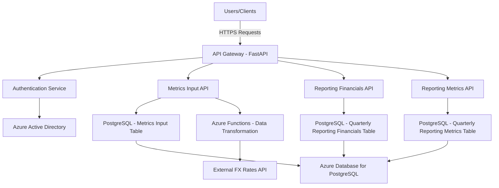

## Components

### API Gateway - FastAPI

Handles incoming HTTP requests for data ingestion and retrieval.

### Authentication Service

Manages OAuth 2.0 authentication integrating with Azure Active Directory.

### Metrics Input API

Processes financial metrics submissions and interacts with the Metrics Input table.

### Reporting Financials API

Provides access to currency-adjusted financial metrics from the Quarterly Reporting Financials table.

### Reporting Metrics API

Serves derived financial metrics from the Quarterly Reporting Metrics table.

### Data Transformation - Azure Functions

Automates the retrieval of foreign exchange rates and calculation of derivative metrics.

### PostgreSQL Database

Stores all financial data in structured tables, hosted on Azure Database for PostgreSQL.

# SYSTEM COMPONENTS ARCHITECTURE

## Component Diagrams

### Detailed Component Diagram

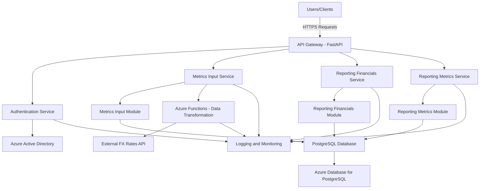

### Component Descriptions

| Component                         | Description                                                                                     |
|-----------------------------------|-------------------------------------------------------------------------------------------------|
| **API Gateway - FastAPI**         | Handles all incoming HTTP requests for data ingestion and retrieval. Manages routing to appropriate services. |
| **Authentication Service**        | Manages OAuth 2.0 authentication and integrates with Azure Active Directory for user management. |
| **Metrics Input Service**         | Processes and manages the ingestion of financial metrics data from portfolio companies.         |
| **Reporting Financials Service**  | Handles retrieval and management of currency-adjusted financial metrics.                       |
| **Reporting Metrics Service**     | Manages the calculation and retrieval of derived financial metrics.                             |
| **Metrics Input Module**          | Internal module within the Metrics Input Service responsible for data validation and storage.    |
| **Reporting Financials Module**   | Internal module within the Reporting Financials Service handling data transformations.           |
| **Reporting Metrics Module**      | Internal module within the Reporting Metrics Service responsible for metric calculations.        |
| **Azure Functions - Data Transformation** | Automates the retrieval of foreign exchange rates and calculation of derivative metrics.         |
| **External FX Rates API**         | Provides current foreign exchange rates used for data transformation processes.                  |
| **PostgreSQL Database**           | Centralized database storing all financial data across four main tables.                         |
| **Azure Database for PostgreSQL** | Managed PostgreSQL service on Azure ensuring high availability and scalability.                  |
| **Logging and Monitoring**        | Centralized system for logging application events and monitoring system performance using Azure Monitor. |

## Sequence Diagrams

### Data Submission and Transformation Workflow

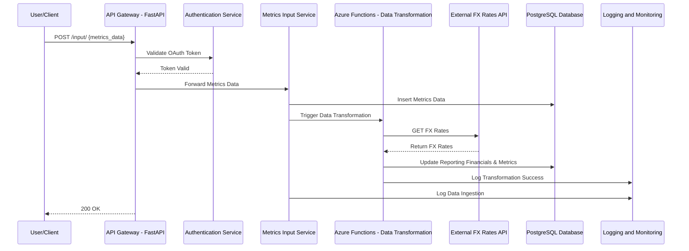

### User Authentication Workflow

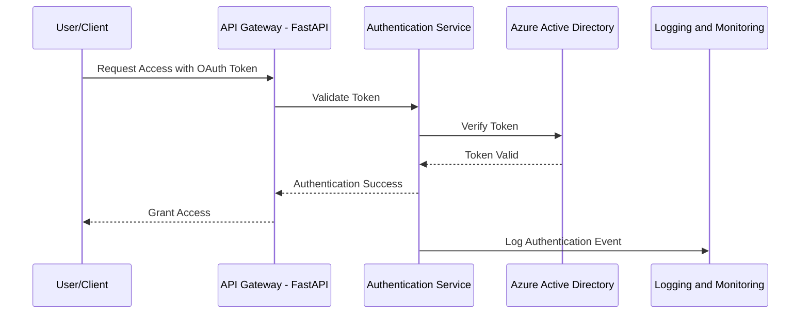

## Data-Flow Diagram

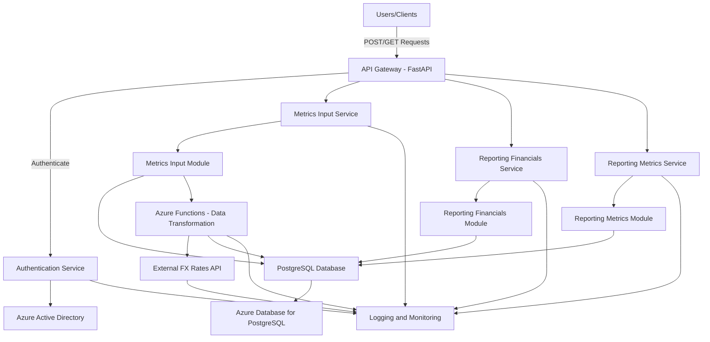

### Data Flow Description

1. **Data Ingestion:**
   - Users or client applications send POST requests to the API Gateway to submit financial metrics data.
   - The API Gateway forwards these requests to the Metrics Input Service after authenticating the user.

2. **Authentication:**
   - The Authentication Service validates the OAuth 2.0 tokens with Azure Active Directory.
   - Upon successful authentication, access is granted to the requesting user.

3. **Data Storage:**
   - The Metrics Input Service processes the incoming data and stores it in the Metrics Input Module within the PostgreSQL Database.
   
4. **Data Transformation:**
   - Upon successful data ingestion, the Azure Functions service is triggered to perform data transformation.
   - This includes retrieving current foreign exchange rates from the External FX Rates API.
   - Using the retrieved FX rates, the service calculates derivative metrics and updates the Reporting Financials and Reporting Metrics Modules in the PostgreSQL Database.

5. **Data Retrieval:**
   - Users can send GET requests to the API Gateway to retrieve data from the Reporting Financials and Reporting Metrics Services.
   - The API Gateway handles these requests by fetching the relevant data from the PostgreSQL Database.

6. **Logging and Monitoring:**
   - All interactions, data transformations, and system events are logged and monitored using Azure Monitor to ensure system reliability and performance.

# SYSTEM DESIGN

## Programming Languages

| Component                     | Programming Language | Justification                                                                                  |
|-------------------------------|-----------------------|------------------------------------------------------------------------------------------------|
| **Backend API Services**      | Python                | Utilizes FastAPI framework for its high performance, ease of use, and strong support for asynchronous programming, which aligns with the system's need for handling concurrent requests efficiently. |
| **Data Transformation Scripts** | Python                | Offers robust libraries for data processing and integration, facilitating the automation of metric calculations and foreign exchange rate retrieval within Azure Functions. |
| **Database Management**       | SQL                   | Standard language for managing and querying PostgreSQL databases, ensuring efficient data manipulation and integrity. |
| **Infrastructure as Code (Optional)** | YAML/JSON              | Used for defining CI/CD pipelines and Azure resource configurations, promoting reproducibility and maintainability of infrastructure setups. |

## Database Design

The system employs a PostgreSQL database hosted on Azure to store and manage financial reporting metrics. The database is structured into four primary tables:

### Database Tables

| Table Name                    | Description                                                                           |
|-------------------------------|---------------------------------------------------------------------------------------|
| **Companies**                 | Stores descriptive information about OMERS Ventures portfolio companies.             |
| **Metrics Input**             | Contains raw financial metrics submitted by portfolio companies in their reporting currency. |
| **Quarterly Reporting Financials** | Holds currency-adjusted financial metrics derived from the Metrics Input table.       |
| **Quarterly Reporting Metrics**    | Stores calculated derivative financial metrics based on the transformed financials data. |

### Entity Relationship Diagram

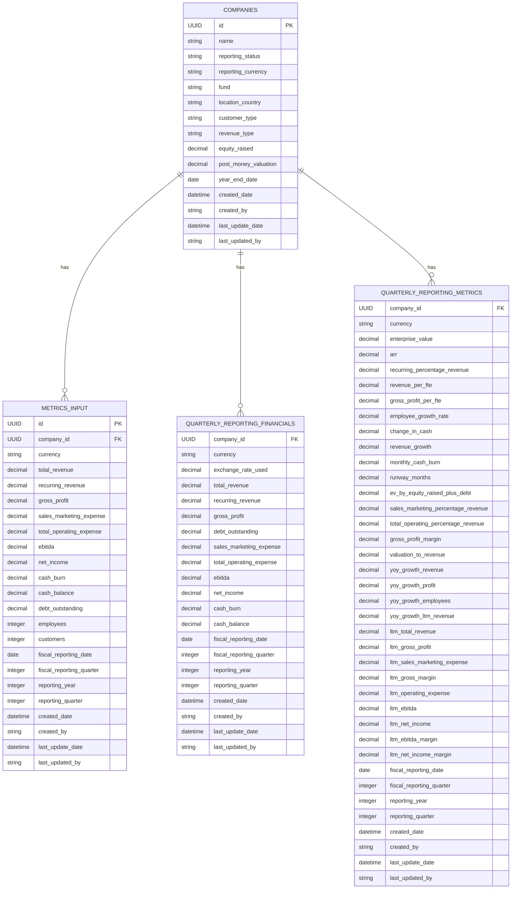

### Indexing and Optimization

| Table Name                    | Indexed Fields                              | Purpose                                              |
|-------------------------------|---------------------------------------------|------------------------------------------------------|
| **Companies**                 | `id`                                        | Primary key for fast lookups and relationships.      |
| **Metrics Input**             | `company_id`, `fiscal_reporting_date`       | Enhances query performance for data retrieval based on company and reporting periods. |
| **Quarterly Reporting Financials** | `company_id`, `reporting_year`, `reporting_quarter` | Optimizes retrieval of financial data for specific reporting periods. |
| **Quarterly Reporting Metrics**    | `company_id`, `reporting_year`, `reporting_quarter` | Improves performance for accessing derived metrics based on company and reporting periods. |

### Data Integrity and Constraints

- **Foreign Keys:** Ensure referential integrity between `Companies` and the other tables (`Metrics Input`, `Quarterly Reporting Financials`, and `Quarterly Reporting Metrics`) by enforcing foreign key constraints on `company_id`.
- **Unique Constraints:** Enforce uniqueness where necessary, such as unique `id` fields in primary tables.
- **Check Constraints:** Validate data formats and ranges, e.g., ensuring `currency` fields follow the ISO 4217 standard and numeric fields are non-negative where applicable.
- **Transactions:** Utilize transactional operations to maintain atomicity during multi-step data processing tasks, ensuring that either all operations succeed or none are applied.

## API Design

The backend platform exposes a RESTful API developed using the FastAPI framework, facilitating secure and efficient data ingestion and retrieval. The API design adheres to best practices, ensuring scalability, maintainability, and ease of integration with internal and external systems.

### API Architecture Diagram


### API Endpoints

| Endpoint               | Method | Description                                      | Authentication       |
|------------------------|--------|--------------------------------------------------|----------------------|
| `/input/`              | GET    | Retrieve input metrics data.                     | OAuth 2.0 Token      |
| `/input/`              | POST   | Submit new input metrics data.                   | OAuth 2.0 Token      |
| `/reporting/`          | GET    | Retrieve quarterly reporting financials data.    | OAuth 2.0 Token      |
| `/metrics/`            | GET    | Retrieve quarterly reporting metrics data.        | OAuth 2.0 Token      |
| `/company/`            | POST   | Create or update company records.                | OAuth 2.0 Token      |

### Authentication and Authorization

- **OAuth 2.0:** Secures all API endpoints, ensuring that only authorized users can access or modify data.
- **Azure Active Directory (AAD):** Manages user identities and roles, integrating seamlessly with OAuth 2.0 to provide robust authentication and authorization mechanisms.
- **Role-Based Access Control (RBAC):** Enforces permissions based on user roles, restricting access to sensitive operations and data based on predefined roles.

### API Data Flow

1. **Data Submission:**
   - **POST `/input/`:** Users submit new financial metrics data.
   - **Authentication:** API validates OAuth 2.0 token with AAD.
   - **Data Processing:** Metrics Input API stores the data in the `Metrics Input` table and triggers Azure Functions for data transformation and derivative metric calculations.

2. **Data Retrieval:**
   - **GET `/input/`, `/reporting/`, `/metrics/`:** Users retrieve financial metrics data based on `company_id` and reporting periods.
   - **Authentication:** API validates OAuth 2.0 token with AAD.
   - **Data Access:** Relevant API service queries the PostgreSQL database and returns structured JSON responses.

### External API Integration

- **External FX Rates API:**
  - **Endpoint:** `https://api.exchangerates.example.com/latest`
  - **Protocol:** HTTPS
  - **Authentication:** API Key embedded in request headers.
  - **Data Format:** JSON
  - **Functionality:**
    - Azure Functions retrieves the latest foreign exchange rates to convert input metrics into multiple currencies.
    - Implements retry logic and error handling to ensure reliability in data fetching.

### API Documentation

- **Swagger/OpenAPI:** Comprehensive documentation of all API endpoints is automatically generated using FastAPI's built-in support for Swagger/OpenAPI.
  - **Access URL:** `/docs`
  - **Features:**
    - Detailed descriptions of each endpoint, including request and response schemas.
    - Interactive interface for testing API endpoints directly from the documentation.
    - Clear specifications of authentication requirements and response codes.

### Error Handling

| Error Type             | Status Code | Description                                      |
|------------------------|-------------|--------------------------------------------------|
| **Authentication Error** | 401 Unauthorized | Returned when OAuth 2.0 token is missing or invalid. |
| **Authorization Error**  | 403 Forbidden    | Returned when the user does not have permission to perform the action. |
| **Validation Error**     | 400 Bad Request   | Returned when the request payload does not meet validation criteria. |
| **Not Found Error**      | 404 Not Found     | Returned when the requested resource does not exist. |
| **Server Error**         | 500 Internal Server Error | Returned when an unexpected error occurs on the server. |

### Rate Limiting and Throttling

- **Implementation:** Utilizes FastAPI middleware to enforce rate limiting, preventing abuse and ensuring fair usage of API resources.
- **Configuration:**
  - Limits the number of requests per user or IP address within a specified time frame.
  - Configurable thresholds based on system capacity and usage patterns.
- **Response:** Returns `429 Too Many Requests` when rate limits are exceeded, along with information on when the user can retry.

### API Versioning

- **Strategy:** URI versioning (e.g., `/v1/input/`) to manage updates and changes without disrupting existing clients.
- **Benefits:**
  - Allows backward compatibility for clients using older API versions.
  - Facilitates incremental enhancements and feature additions.

### Pagination

- **Implementation:** Supports pagination for GET endpoints returning large datasets to enhance performance and usability.
- **Parameters:**
  - `limit`: Number of records to return per page.
  - `offset`: Number of records to skip before starting to collect the result set.
- **Response Structure:**
  - Includes metadata such as `total_records`, `current_page`, `next_page`, and `previous_page` links.

### Example API Usage

#### GET Input Metrics

**Request:**

```http
GET https://api.omersventures.com/v1/input_metrics?company_id=reciLI8sBuJE9vEAv&start_reporting_date=2022-01-01&end_reporting_date=2022-12-31
Authorization: Bearer <OAuth_Token>
```

**Response:**

```json
{
    "company_id": "reciLI8sBuJE9vEAv",
    "reporting_year": 2022,
    "reporting_quarter": 4,
    "currency": "USD",
    "total_revenue": 4194199.0,
    "recurring_revenue": 3912138.0,
    "gross_profit": 2730244.0,
    "sales_marketing_expense": 1470828.0,
    "total_operating_expense": 7195136.0,
    "ebitda": -4464892.0,
    "net_income": -4339102.0,
    "cash_burn": -4464892.0,
    "cash_balance": 32407138.0,
    "debt_outstanding": null,
    "employees": 1,
    "customers": null,
    "fiscal_reporting_quarter": 4,
    "fiscal_reporting_date": "2022-12-31 00:00:00",
    "created_date": "2023-08-24 15:25:11",
    "created_by": "ManualTest",
    "last_update_date": null,
    "last_updated_by": null
}
```

#### POST Company

**Request:**

```http
POST https://api.omersventures.com/v1/company/
Authorization: Bearer <OAuth_Token>
Content-Type: application/json

{
  "company_id": "reciLI8sBuJE9vEAv",
  "company_name": "WorkRamp",
  "reporting_status": "Active",
  "reporting_currency": "USD",
  "fund": "Fund IV",
  "customer_type": "B2B",
  "location_country": "United States",
  "revenue_type": "Recurring",
  "equity_raised": 67.20,
  "post_money_valuation": 215.0,
  "year_end_date": "2022-12-31"
}
```

**Response:**

```json
{
    "message": "Company record created/updated successfully.",
    "company_id": "reciLI8sBuJE9vEAv"
}
```

### Security Considerations

- **HTTPS Only:** All API communication is conducted over HTTPS to ensure data encryption in transit.
- **Input Validation:** All incoming data is validated against predefined schemas to prevent injection attacks and ensure data integrity.
- **Throttling:** Rate limiting protects the API from excessive requests, mitigating potential denial-of-service attacks.
- **Audit Logging:** All API interactions are logged with details such as timestamp, user ID, and action performed for accountability and forensic analysis.

### Integration with Azure Services

| Azure Service                   | Purpose                                                                 |
|---------------------------------|-------------------------------------------------------------------------|
| **Azure App Service**           | Hosts the FastAPI-based API, providing scalable and managed web hosting. |
| **Azure Functions**             | Executes serverless data transformation scripts triggered by data ingestion events. |
| **Azure Active Directory (AAD)**| Manages user identities and integrates with OAuth 2.0 for authentication. |
| **Azure Monitor**               | Monitors API performance, logs, and sets up alerts for anomalies or failures. |
| **Azure Blob Storage**          | Stores encrypted backups of the PostgreSQL database.                     |
| **Azure DevOps**                | Facilitates CI/CD pipelines for automated testing and deployment of API services. |

### API Lifecycle Management

- **Development:** Utilizes version control (e.g., Git) within Azure DevOps to manage API codebase, enabling collaborative development and change tracking.
- **Testing:** Implements automated unit, integration, and end-to-end tests within CI/CD pipelines to ensure API reliability and correctness before deployment.
- **Deployment:** Leverages Azure DevOps pipelines to deploy API updates to staging and production environments with minimal downtime, utilizing blue-green or canary deployment strategies as needed.
- **Maintenance:** Regularly updates API documentation, monitors performance metrics, and addresses any security vulnerabilities or performance issues promptly.

### Example Sequence Diagram: Data Submission and Transformation


### Example Response Structure

All API responses follow a consistent JSON structure, including status codes, messages, and data payloads where applicable.

```json
{
    "status": "success",
    "code": 200,
    "message": "Operation completed successfully.",
    "data": {
        // Relevant data based on the endpoint
    }
}
```

### Conclusion

The API design ensures secure, efficient, and scalable interactions between users, internal services, and external systems. By leveraging FastAPI's capabilities and integrating seamlessly with Azure services, the backend platform provides a robust foundation for managing and retrieving financial reporting metrics essential for OMERS Ventures' operational needs.

# USER INTERFACE DESIGN

## Overview

The User Interface (UI) for the backend platform is designed to provide OMERS Ventures' internal users with an intuitive and efficient means of managing and accessing financial reporting metrics. The UI consists of several key components, each tailored to specific functionalities such as dashboard visualization, company management, metrics input, reporting, user administration, and system settings. The design prioritizes ease of use, clarity, and consistency, ensuring that users can navigate and perform tasks with minimal effort.

## User Roles and Permissions

| Role          | Permissions                                                                                     |
|---------------|-------------------------------------------------------------------------------------------------|
| **Admin**     | Full access to all features, including user management, system settings, and data administration. |
| **Editor**    | Can add, update, and view data across all modules but cannot manage users or system settings.    |
| **Viewer**    | Can only view data and access reporting dashboards.                                           |

## Components

### 1. Dashboard

The Dashboard provides a high-level overview of key financial metrics and system status indicators. It serves as the central hub for users to monitor the performance and health of portfolio companies.

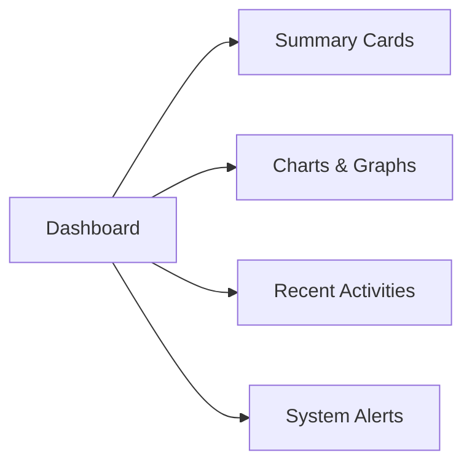

#### Layout

- **Summary Cards:** Display aggregated metrics such as total revenue, EBITDA, cash balance, and number of active portfolio companies.
- **Charts & Graphs:** Visual representations of financial trends, revenue growth, and other key performance indicators.
- **Recent Activities:** Lists the latest data submissions and updates made within the system.
- **System Alerts:** Notifications regarding system status, backup completions, and any issues requiring attention.

#### Functionality

- Real-time data updates to reflect the latest financial metrics.
- Interactive charts allowing users to filter and drill down into specific data points.
- Quick access to recently modified records for efficient tracking.

### 2. Company Management

The Company Management module allows users to add, update, and view detailed information about portfolio companies.

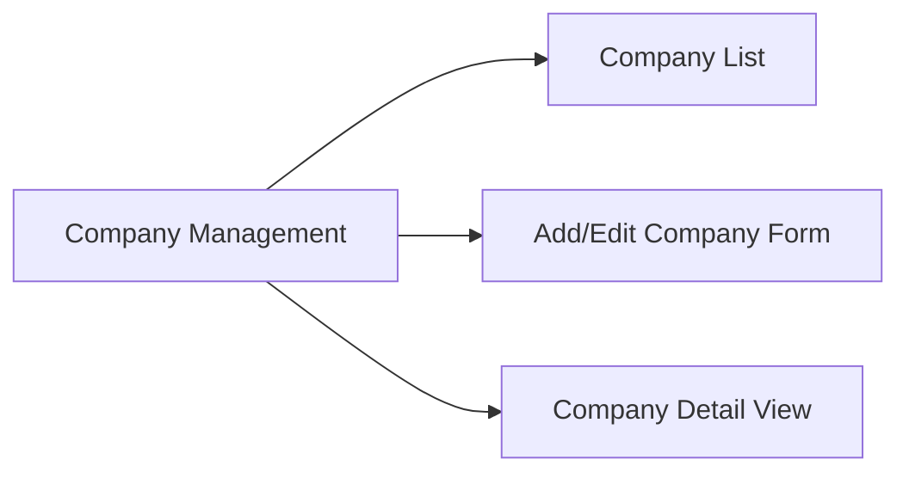

#### Layout

- **Company List:** A searchable and sortable table listing all portfolio companies with key details.
- **Add/Edit Company Form:** A form interface for creating new company records or editing existing ones.
- **Company Detail View:** A dedicated page displaying comprehensive information about a specific company, including metrics and reporting status.

#### Functionality

- **Search & Sort:** Easily find companies using filters based on name, status, currency, and other attributes.
- **CRUD Operations:** Perform create, read, update, and delete (where permitted) operations on company records.
- **Validation:** Ensure all required fields are correctly filled and adhere to predefined formats before submission.

### 3. Metrics Input

The Metrics Input module facilitates the submission and management of financial metrics from portfolio companies.

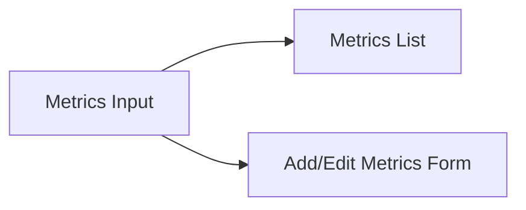

#### Layout

- **Metrics List:** Displays all submitted metrics with options to filter by company and reporting period.
- **Add/Edit Metrics Form:** A form for entering new metrics or modifying existing ones, ensuring data integrity through validation.

#### Functionality

- **Bulk Upload:** Support for uploading metrics data in bulk via CSV or Excel files.
- **Validation Rules:** Enforce data validation to prevent incorrect or incomplete submissions.
- **Status Indicators:** Show the submission status and highlight any issues that need attention.

### 4. Reporting Financials

The Reporting Financials module provides access to currency-adjusted financial metrics, enabling detailed financial analysis.

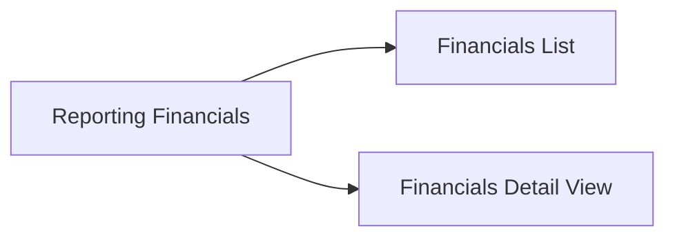

#### Layout

- **Financials List:** A table displaying all quarterly financial reports with filtering options.
- **Financials Detail View:** Detailed view of financial metrics for a specific company and reporting period.

#### Functionality

- **Currency Conversion:** Automatically display financial metrics in multiple currencies (Local, USD, CAD).
- **Trend Analysis:** Tools to compare metrics across different quarters and years.
- **Export Options:** Ability to export financial reports in various formats for external analysis.

### 5. Reporting Metrics

The Reporting Metrics module offers access to derived financial metrics, supporting in-depth performance evaluation.

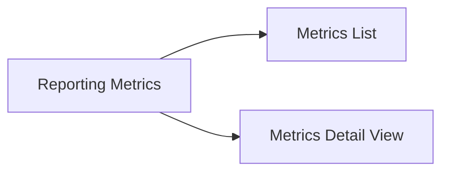

#### Layout

- **Metrics List:** A comprehensive list of all derived metrics with filtering capabilities.
- **Metrics Detail View:** Detailed metrics for individual companies, including calculations and historical comparisons.

#### Functionality

- **Custom Calculations:** View and interpret complex financial metrics calculated from input data.
- **Comparative Analysis:** Compare derived metrics across different companies and reporting periods.
- **Visualization:** Graphical representation of derived metrics for better understanding and presentation.

### 6. User Management

The User Management module is accessible only to Admins and allows for managing user accounts and permissions.

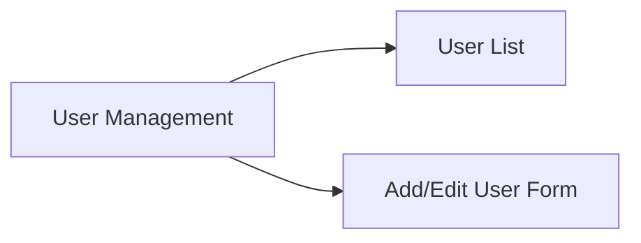

#### Layout

- **User List:** A table listing all users with details such as role, status, and last login.
- **Add/Edit User Form:** Interface for creating new users or modifying existing user roles and permissions.

#### Functionality

- **Role Assignment:** Assign and modify user roles (Admin, Editor, Viewer) to control access levels.
- **Account Management:** Enable or disable user accounts as needed.
- **Audit Logs:** Track changes made to user accounts for accountability.

### 7. Settings

The Settings module allows administrators to configure system-wide settings and preferences.

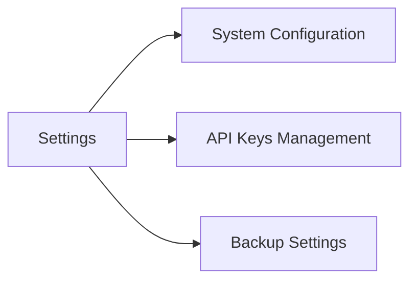

#### Layout

- **System Configuration:** Options to configure system parameters such as currency settings, reporting periods, and data validation rules.
- **API Keys Management:** Interface for managing API keys used for external integrations, including the FX Rates API.
- **Backup Settings:** Configuration for backup schedules, retention policies, and restoration processes.

#### Functionality

- **Customization:** Tailor system settings to meet organizational requirements and preferences.
- **Security:** Manage and secure API keys to ensure safe interactions with external services.
- **Backup Control:** Adjust backup frequencies and retention periods to align with data protection policies.

## Wireframe Mockups

### Dashboard Wireframe

```
+----------------------------------------------+
|                  Dashboard                   |
+----------------------------------------------+
| Summary Cards |      Charts & Graphs         |
|--------------|------------------------------|
| Total Revenue | Revenue Growth Chart       |
| EBITDA        | Cash Burn Trend            |
| Cash Balance  | Employee Growth Graph      |
| Active Portcos|                            |
+----------------------------------------------+
|           Recent Activities | System Alerts |
|-----------------------------|---------------|
| - Company A updated metrics  | Warning: Backup |
| - Company B submitted data   | failed. Retry    |
| - ...                        |                  |
+---------------------------------+---------------+
```

### Company Management Wireframe

```
+----------------------------------------------+
|             Company Management               |
+----------------------------------------------+
| [Search] [Filter by Status] [Add Company]    |
+----------------------------------------------+
| ID         | Name       | Status | Currency | Actions |
|------------|------------|--------|----------|---------|
| reciLI8sBu | WorkRamp   | Active | USD      | Edit/Delete |
| ...        | ...        | ...    | ...      | ...         |
+----------------------------------------------+
```

### Metrics Input Wireframe

```
+----------------------------------------------+
|               Metrics Input                  |
+----------------------------------------------+
| [Search] [Filter by Company] [Upload CSV]    |
+----------------------------------------------+
| ID         | Company     | Quarter | Total Revenue | Actions |
|------------|-------------|---------|---------------|---------|
| 1          | WorkRamp    | Q4 2022 | $4,194,199    | Edit    |
| ...        | ...         | ...     | ...           | ...     |
+----------------------------------------------+
```

### Reporting Financials Wireframe

```
+----------------------------------------------+
|           Reporting Financials               |
+----------------------------------------------+
| [Search] [Filter by Currency] [Export]       |
+----------------------------------------------+
| ID         | Company    | Quarter | Revenue (USD) | Actions |
|------------|------------|---------|---------------|---------|
| 1          | WorkRamp   | Q4 2022 | $5,000,000    | View    |
| ...        | ...        | ...     | ...           | ...     |
+----------------------------------------------+
```

### Reporting Metrics Wireframe

```
+----------------------------------------------+
|            Reporting Metrics                 |
+----------------------------------------------+
| [Search] [Filter by Metric] [Export]         |
+----------------------------------------------+
| ID         | Company    | Quarter | ARR | EV | Actions |
|------------|------------|---------|-----|----|---------|
| 1          | WorkRamp   | Q4 2022 | $1M | $2M| View    |
| ...        | ...        | ...     | ... | ...| ...     |
+----------------------------------------------+
```

### User Management Wireframe

```
+----------------------------------------------+
|               User Management                |
+----------------------------------------------+
| [Search] [Filter by Role] [Add User]         |
+----------------------------------------------+
| ID         | Username    | Role   | Status | Actions |
|------------|-------------|--------|--------|---------|
| 1          | johndoe     | Admin  | Active | Edit/Delete |
| ...        | ...         | ...    | ...    | ...         |
+----------------------------------------------+
```

### Settings Wireframe

```
+----------------------------------------------+
|                    Settings                  |
+----------------------------------------------+
| [System Configuration] [API Keys] [Backups]  |
+----------------------------------------------+

+----------------------------------------------+
|          System Configuration                |
+----------------------------------------------+
| Currency Settings: [USD] [CAD] [EUR]         |
| Reporting Periods: Q1, Q2, Q3, Q4             |
| Data Validation Rules: [Manage Rules]        |
| [Save Changes]                               |
+----------------------------------------------+

+----------------------------------------------+
|               API Keys Management            |
+----------------------------------------------+
| API Service       | API Key       | Actions    |
|-------------------|---------------|------------|
| FX Rates API      | abc123xyz     | Edit/Delete|
| ...               | ...           | ...        |
| [Add New API Key]                           |
+----------------------------------------------+

+----------------------------------------------+
|                Backup Settings               |
+----------------------------------------------+
| Backup Frequency: Daily [X] Weekly [ ]       |
| Retention Period: 30 Days                    |
| [Save Settings]                              |
+----------------------------------------------+
```

## Functionality Descriptions

### Dashboard

- **Summary Cards:** Provide quick insights into the overall financial status and performance metrics of the portfolio.
- **Charts & Graphs:** Offer visual trends and patterns, allowing users to identify growth areas and potential issues.
- **Recent Activities:** Enable users to stay updated on the latest data submissions and system changes.
- **System Alerts:** Inform users of critical system events, ensuring prompt attention to potential issues.

### Company Management

- **Company List:** Allows users to view and manage all portfolio companies in a centralized table.
- **Add/Edit Company Form:** Facilitates the creation of new company records or the modification of existing ones with necessary validations.
- **Company Detail View:** Provides an in-depth overview of a company's financial metrics and reporting status.

### Metrics Input

- **Metrics List:** Enables users to review all submitted financial metrics, filterable by company and reporting period.
- **Add/Edit Metrics Form:** Streamlines the process of inputting or updating financial data with built-in validation to maintain data integrity.
- **Bulk Upload:** Supports efficient data entry through the ability to upload multiple records simultaneously.

### Reporting Financials

- **Financials List:** Offers a comprehensive view of all financial reports, sortable and filterable to assist in data analysis.
- **Financials Detail View:** Allows users to delve into specific financial reports, examining currency conversions and detailed metrics.
- **Export Options:** Provides flexibility to export financial data for external use and analysis.

### Reporting Metrics

- **Metrics List:** Consolidates all derived financial metrics, making it easy to locate and assess specific metrics.
- **Metrics Detail View:** Presents detailed calculations and historical comparisons to support thorough financial analysis.
- **Visualization Tools:** Enhances understanding through graphical representations of complex metric data.

### User Management

- **User List:** Displays all users with their respective roles and statuses, facilitating easy management and oversight.
- **Add/Edit User Form:** Simplifies the process of onboarding new users or adjusting existing user permissions.
- **Audit Logs:** Maintains a record of all user-related actions for security and accountability.

### Settings

- **System Configuration:** Allows administrators to tailor the system's operational parameters to align with organizational needs.
- **API Keys Management:** Ensures secure handling and management of API keys necessary for external integrations.
- **Backup Settings:** Provides control over backup schedules and retention policies to safeguard data effectively.

## Interaction Flow

### Data Submission Flow

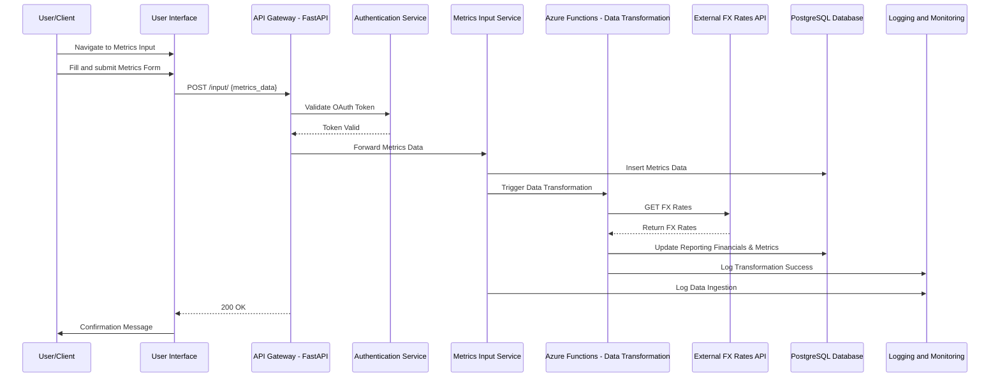

### User Authentication Flow

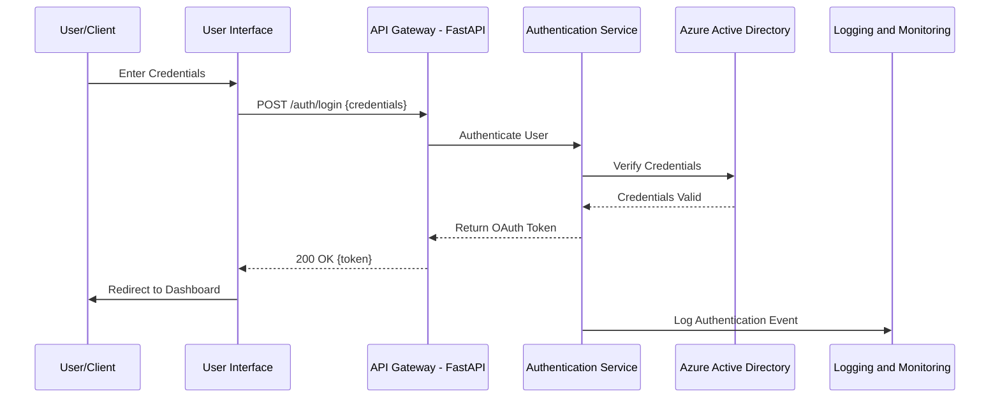

## Security Considerations

- **Authentication:** All UI interactions requiring data access are secured via OAuth 2.0 tokens, ensuring that only authenticated users can perform actions.
- **Authorization:** Role-Based Access Control (RBAC) enforces permissions, restricting functionalities based on user roles (Admin, Editor, Viewer).
- **Data Validation:** All input forms include client-side and server-side validation to prevent invalid or malicious data submissions.
- **Session Management:** Secure session handling mechanisms prevent unauthorized access through session hijacking or fixation.
- **HTTPS Enforcement:** All UI communications occur over HTTPS to secure data in transit.

## Accessibility

- **Responsive Design:** The UI is fully responsive, ensuring usability across various devices and screen sizes.
- **Keyboard Navigation:** All interactive elements can be accessed and operated via keyboard, enhancing accessibility for users with disabilities.
- **ARIA Labels:** Implemented Accessible Rich Internet Applications (ARIA) labels to improve compatibility with screen readers.
- **Color Contrast:** Ensured sufficient color contrast for text and UI elements to aid users with visual impairments.

## Usability Enhancements

- **Intuitive Navigation:** Clear and consistent navigation menus allow users to easily access different modules and functionalities.
- **Tooltips & Help Guides:** Contextual tooltips and integrated help guides assist users in understanding form fields and system operations.
- **Feedback Mechanisms:** Real-time feedback on form submissions, data processing statuses, and system alerts keeps users informed about their actions and system states.
- **Bulk Operations:** Support for bulk data uploads and edits enhances efficiency for users handling large datasets.

## Performance Considerations

- **Optimized Loading:** Lazy loading of UI components and asynchronous data fetching minimize initial load times and enhance responsiveness.
- **Caching Mechanisms:** Implemented client-side caching for frequently accessed data to reduce server load and improve access speeds.
- **Scalable Architecture:** Designed to handle increased user load and data volume without compromising UI performance.

## Conclusion

The User Interface Design for the backend platform is meticulously crafted to provide OMERS Ventures with a powerful yet user-friendly tool for managing and analyzing financial reporting metrics. Through thoughtful layout, comprehensive functionality, and adherence to security and accessibility standards, the UI ensures that users can efficiently perform their tasks while maintaining data integrity and system reliability.

# TECHNOLOGY STACK

## Programming Languages

| Component                     | Programming Language | Justification                                                                                                                                                                                                                                                                                                                   |
|-------------------------------|-----------------------|---------------------------------------------------------------------------------------------------------------------------------------------------------------------------------------------------------------------------------------------------------------------------------------------------------------------------------|
| **Backend API Services**      | Python                | Python is chosen for its versatility and strong support for data processing and web development. The FastAPI framework, which is built on Python, offers high performance and ease of development, making it ideal for building scalable RESTful APIs. Additionally, Python’s extensive libraries facilitate efficient data transformation and integration tasks. |
| **Data Transformation Scripts** | Python                | Python provides robust libraries such as Pandas and NumPy for data manipulation and calculation, which are essential for transforming input metrics and computing derivative financial metrics. Its seamless integration with Azure Functions ensures efficient automation of data processing workflows.                                        |
| **Database Management**       | SQL                   | SQL is the standard language for managing and querying PostgreSQL databases. It ensures efficient data manipulation, supports complex queries, and maintains data integrity through transactional operations and constraints.                                                                                                               |
| **Infrastructure as Code (Optional)** | YAML/JSON              | YAML and JSON are used for defining CI/CD pipelines and Azure resource configurations. These languages promote reproducibility and maintainability of infrastructure setups, enabling automated deployments and consistent environment configurations across development and production stages.                                                           |

## Frameworks and Libraries

| Component                     | Framework/Library     | Purpose                                                                                                                                                                              |
|-------------------------------|-----------------------|--------------------------------------------------------------------------------------------------------------------------------------------------------------------------------------|
| **Backend API Development**   | FastAPI               | A high-performance web framework for building APIs with Python, offering automatic interactive documentation and support for asynchronous programming.                                   |
| **Data Transformation**       | Pandas, NumPy         | Essential for data manipulation, transformation, and numerical computations required for calculating derivative financial metrics from input data.                                        |
| **Authentication**            | OAuthLib, PyJWT       | Libraries for implementing OAuth 2.0 authentication and handling JSON Web Tokens (JWT) to secure API endpoints and manage user sessions.                                              |
| **Testing**                   | Pytest                | A robust testing framework for writing and executing unit, integration, and end-to-end tests to ensure the reliability and correctness of the backend services.                        |
| **API Documentation**         | Swagger/OpenAPI       | Integrated with FastAPI to automatically generate comprehensive API documentation, facilitating ease of integration and reference for developers.                                      |
| **Asynchronous Processing**   | Celery                | Enables asynchronous task processing and scheduling, complementing Azure Functions for handling data transformation workflows efficiently.                                           |
| **Logging and Monitoring**    | Loguru, Prometheus    | Libraries for enhanced logging capabilities and performance monitoring, ensuring effective tracking of system activities and performance metrics.                                     |
| **Configuration Management**  | Pydantic              | Utilized by FastAPI for data validation and settings management, ensuring robust and error-free handling of incoming data and configuration parameters.                               |
| **Dependency Injection**      | Dependency Injector   | Facilitates the management of dependencies within the FastAPI application, promoting modularity and ease of testing.                                                                    |

## Databases

| Database Type                 | Technology            | Justification                                                                                                                                                                                                          |
|-------------------------------|-----------------------|------------------------------------------------------------------------------------------------------------------------------------------------------------------------------------------------------------------------|
| **Primary Database**          | PostgreSQL            | PostgreSQL is selected for its advanced features, reliability, and strong support for complex queries and transactions. The managed service, Azure Database for PostgreSQL, ensures high availability, scalability, and seamless integration with other Azure services. |
| **Caching**                   | Redis                 | Redis is employed as an in-memory data store to cache frequently accessed data, reducing database load and improving response times for API requests.                                                               |

## Third-Party Services

| Service Type                  | Service Name          | Purpose                                                                                                                                                                                                               |
|-------------------------------|-----------------------|-----------------------------------------------------------------------------------------------------------------------------------------------------------------------------------------------------------------------|
| **External APIs**             | Foreign Exchange Rates API | Retrieves up-to-date foreign exchange rates required for converting input metrics into multiple currencies during the data transformation process.                                                                      |
| **Cloud Infrastructure**      | Azure Functions       | Provides serverless compute capabilities to execute data transformation scripts automatically upon data ingestion events, ensuring scalable and efficient processing.                                                   |
| **Authentication and Authorization** | Azure Active Directory (AAD) | Manages user identities and roles, integrating with OAuth 2.0 to provide secure authentication and Role-Based Access Control (RBAC) for the backend platform.                                                           |
| **CI/CD Pipelines**           | Azure DevOps          | Facilitates the automation of the build, test, and deployment processes through Continuous Integration and Continuous Deployment (CI/CD) pipelines, ensuring rapid and reliable delivery of code updates.              |
| **Monitoring and Logging**    | Azure Monitor, Azure Log Analytics | Monitors system performance, tracks application and system logs, and sets up alerts for any anomalies or failures, ensuring system reliability and enabling prompt issue resolution.                                        |
| **Storage Services**          | Azure Blob Storage    | Stores encrypted backups of the PostgreSQL database, ensuring data durability and secure storage in compliance with organizational and regulatory requirements.                                                           |
| **Containerization**          | Docker                | Utilized for containerizing the FastAPI application, ensuring consistent deployment environments across development, staging, and production, and facilitating scalability and maintainability.                           |
| **Load Balancing**            | Azure Load Balancer   | Distributes incoming API traffic evenly across multiple instances of the FastAPI service, ensuring high availability and reliability by preventing any single instance from becoming a bottleneck.                      |

## Diagram: Technology Stack Overview

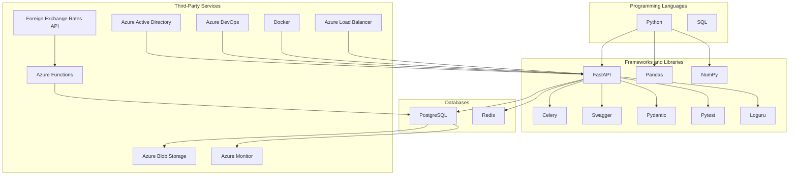

# SECURITY CONSIDERATIONS

## AUTHENTICATION AND AUTHORIZATION

The backend platform employs robust authentication and authorization mechanisms to ensure that only authorized users can access and perform actions within the system.

### Authentication

- **OAuth 2.0:** Utilized for secure user authentication, enabling users to obtain limited access tokens to interact with API endpoints.
- **Azure Active Directory (AAD):** Integrates with OAuth 2.0 to manage user identities, providing centralized authentication and seamless integration with enterprise environments.
- **Multi-Factor Authentication (MFA):** Enforced for all user accounts to add an additional layer of security beyond traditional password-based authentication.

### Authorization

- **Role-Based Access Control (RBAC):** Implemented to restrict access to resources based on user roles. The roles include:
  - **Admin:** Full access to all system features, including user management and system settings.
  - **Editor:** Can add, update, and view data across all modules but cannot manage users or system settings.
  - **Viewer:** Limited to viewing data and accessing reporting dashboards.

### Authorization Flow

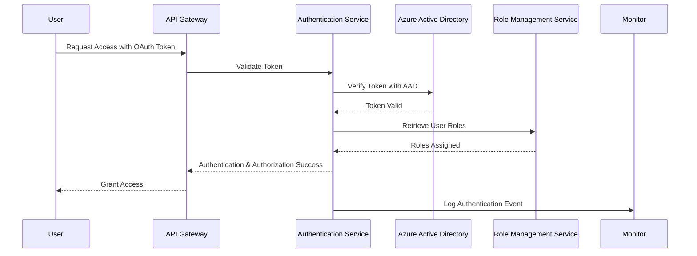

## DATA SECURITY

Sensitive financial information is safeguarded through comprehensive data security measures, ensuring data confidentiality, integrity, and availability.

### Data Encryption

| Data Type       | Encryption Method       | Description                                      |
|-----------------|-------------------------|--------------------------------------------------|
| **Data at Rest**| AES-256                 | All sensitive data stored in the PostgreSQL database is encrypted using AES-256 encryption to protect against unauthorized access. |
| **Data in Transit** | TLS 1.2 or Higher      | Data transmitted between clients, API services, and the database is secured using TLS 1.2 or higher protocols to prevent interception and tampering. |

### Data Access Controls

- **Least Privilege Principle:** Users and services are granted the minimum level of access necessary to perform their functions, reducing the risk of unauthorized data access.
- **Database Role Management:** Specific roles are created within PostgreSQL to segregate access rights, ensuring that users can only interact with the data they are permitted to.

### Data Masking and Anonymization

- **Sensitive Fields:** Personally identifiable information (PII) and other sensitive fields are masked or anonymized in reports and logs to protect user privacy.
- **Access Logs:** Detailed access logs are maintained, recording who accessed what data and when, to facilitate auditing and monitoring.

### Data Integrity

- **Transactional Integrity:** Database transactions are used to ensure that data modifications are atomic, consistent, isolated, and durable (ACID properties).
- **Validation Rules:** Both API layer and database constraints enforce strict validation rules to maintain data accuracy and integrity.

## SECURITY PROTOCOLS

The system adheres to established security protocols and best practices to maintain a secure and resilient infrastructure.

### Security Standards and Best Practices

- **ISO/IEC 27001 Compliance:** The platform aligns with ISO/IEC 27001 standards for information security management, ensuring systematic protection of sensitive data.
- **GDPR and CCPA Compliance:** Adheres to data protection regulations such as GDPR and CCPA, ensuring lawful handling of personal data with appropriate consent and data subject rights.

### Vulnerability Management

- **Regular Security Audits:** Conduct periodic security assessments and vulnerability scans to identify and remediate potential security weaknesses.
- **Patch Management:** Timely application of security patches and updates to all software components to mitigate known vulnerabilities.

### Intrusion Detection and Prevention

- **Web Application Firewall (WAF):** Deployed to protect the API from common web vulnerabilities such as SQL injection, cross-site scripting (XSS), and other OWASP Top Ten threats.
- **Intrusion Detection and Prevention Systems (IDPS):** Monitors network traffic and system activities to detect and respond to suspicious behaviors and potential security incidents.

### Incident Response

- **Incident Response Plan:** Established procedures for detecting, responding to, and recovering from security incidents, minimizing impact and restoring normal operations promptly.
- **Automated Alerts:** Configured within Azure Monitor to notify administrators of critical security events and anomalies in real-time.

### Continuous Monitoring

- **Azure Monitor:** Utilized for continuous monitoring of system performance, security metrics, and logs, enabling proactive identification and resolution of security issues.
- **Centralized Logging:** All security-related events are logged centrally using Azure Log Analytics, facilitating comprehensive auditing and forensic analysis.

### Secure Development Practices

- **Code Reviews:** Mandatory code reviews to ensure adherence to security best practices and to identify potential vulnerabilities during the development phase.
- **Static and Dynamic Analysis:** Integration of static code analysis tools and dynamic testing within the CI/CD pipeline to detect and address security flaws before deployment.

### Access Control Policies

- **Network Security Groups (NSGs):** Configured to control inbound and outbound traffic to Azure resources, restricting access based on predefined security rules.
- **Virtual Networks (VNets):** Utilized to isolate and secure communication between different components within the Azure environment, preventing unauthorized access from external sources.

### Backup Security

- **Encrypted Backups:** All database backups stored in Azure Blob Storage are encrypted at rest, ensuring their confidentiality and integrity.
- **Access Restrictions:** Backup storage access is restricted to authorized personnel only, with stringent access controls and auditing in place.

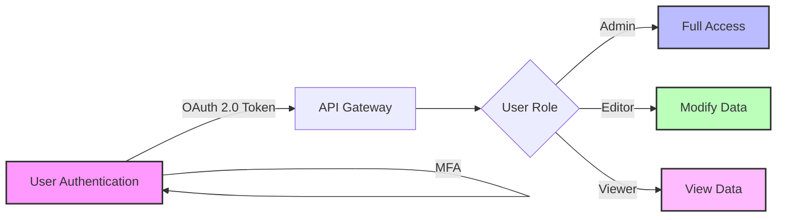

```mermaid
flowchart TD
    subgraph Data Security
        D1[Data Encryption]
        D2[Access Controls]
        D3[Data Masking]
        D4[Data Integrity]
    end

    subgraph Authentication & Authorization
        A1[OAuth 2.0]
        A2[AAD Integration]
        A3[RBAC]
        A4[MFA]
    end

    subgraph Security Protocols
        S1[ISO/IEC 27001]
        S2[GDPR & CCPA Compliance]
        S3[Vulnerability Management]
        S4[IDPS]
        S5[Incident Response]
        S6[Continuous Monitoring]
        S7[Secure Development Practices]
    end

    A1 --> A2
    A2 --> A3
    A3 --> A4
    D1 --> D2
    D2 --> D3
    D3 --> D4

    A4 --> S1
    S1 --> S2
    S2 --> S3
    S3 --> S4
    S4 --> S5
    S5 --> S6
    S6 --> S7
```

## Summary Table of Security Measures

| Security Aspect               | Measures Implemented                                                                                  |
|-------------------------------|--------------------------------------------------------------------------------------------------------|
| **Authentication**            | OAuth 2.0, Azure Active Directory, Multi-Factor Authentication (MFA)                                  |
| **Authorization**             | Role-Based Access Control (RBAC) with Admin, Editor, and Viewer roles                                 |
| **Data Encryption**           | AES-256 for data at rest, TLS 1.2+ for data in transit                                                |
| **Access Controls**           | Least Privilege Principle, Database Role Management                                                   |
| **Data Masking**              | Masking and anonymization of sensitive fields                                                          |
| **Vulnerability Management**  | Regular security audits, patch management, vulnerability scans                                        |
| **Intrusion Detection**       | Web Application Firewall (WAF), Intrusion Detection and Prevention Systems (IDPS)                      |
| **Incident Response**         | Established incident response plan, automated alerting via Azure Monitor                               |
| **Continuous Monitoring**     | Azure Monitor, Centralized Logging with Azure Log Analytics                                         |
| **Secure Development**        | Mandatory code reviews, static and dynamic analysis integrated into CI/CD pipeline                     |
| **Network Security**          | Network Security Groups (NSGs), Virtual Networks (VNets), TLS 1.2+                                   |
| **Backup Security**           | Encrypted backups in Azure Blob Storage, restricted access to backup storage                          |
| **Compliance**                | ISO/IEC 27001, GDPR, CCPA compliance adherence                                                        |

## Additional Diagrams

### Data Security Workflow

```mermaid
graph TD
    A[Data Submission] --> B[API Gateway]
    B --> C[Authentication Service]
    C --> D[Azure Active Directory]
    C --> E[MFA Verification]
    E --> F[Role-Based Access Control]
    F --> G[Secure Data Storage]
    G --> H[Data Encryption]
    H --> I[PostgreSQL Database]
    G --> J[Access Controls]
    J --> K[Least Privilege Access]
    I --> L[Encrypted Backups]
    I --> M[Data Masking] 
```

### Security Lifecycle

```mermaid
graph LR
    A[Secure Development] --> B[Code Reviews]
    B --> C[Static Analysis]
    C --> D[Dynamic Testing]
    D --> E[Deployment]
    E --> F[Continuous Monitoring]
    F --> G[Vulnerability Management]
    G --> A
```

## Compliance and Regulatory Adherence

The backend platform ensures compliance with all relevant financial data protection regulations and industry standards to maintain legal and operational integrity.

- **GDPR & CCPA:** Implements data handling procedures, data subject rights mechanisms, and data anonymization/masking techniques to comply with GDPR and CCPA.
- **ISO/IEC 27001:** Adheres to ISO/IEC 27001 standards for information security management, ensuring systematic protection of sensitive data.
- **Audit Logs:** Maintains comprehensive audit logs for all access and modification actions to support forensic investigations and compliance reporting.
- **Regular Assessments:** Conducts regular compliance assessments and gap analyses to identify and address adherence issues promptly.
- **Data Retention Policies:** Enforces data retention policies in line with regulatory requirements, ensuring data is stored and deleted appropriately.
- **Training and Awareness:** Provides training for development and operational teams on compliance requirements and best practices for data protection.

```mermaid
graph TB
    A[Data Handling Procedures] --> B[GDPR Compliance]
    A --> C[CCPA Compliance]
    A --> D[ISO/IEC 27001 Standards]
    B --> E[Data Subject Rights]
    C --> F[Data Anonymization]
    D --> G[Information Security Management]
    E --> H[Access Logs]
    F --> H
    G --> H
```

## Summary

The Security Considerations section outlines a comprehensive approach to safeguarding the backend platform through robust authentication and authorization mechanisms, stringent data security measures, and adherence to established security protocols and compliance standards. By leveraging Azure’s security features and implementing industry best practices, the platform ensures the protection of sensitive financial data and maintains trust with OMERS Ventures and its portfolio companies.

# INFRASTRUCTURE

## Deployment Environment

The backend platform is deployed in a cloud environment utilizing Microsoft Azure services to ensure scalability, reliability, and security. The deployment strategy leverages Azure's managed services to minimize operational overhead and facilitate seamless integration with other Azure-native tools and services.

## Cloud Services

| Azure Service                   | Purpose                                                                                                             | Justification                                                                                                                                                                |
|---------------------------------|---------------------------------------------------------------------------------------------------------------------|------------------------------------------------------------------------------------------------------------------------------------------------------------------------------|
| **Azure App Service**           | Hosts the FastAPI-based RESTful API, providing a scalable and managed web hosting environment.                     | Offers built-in scalability, load balancing, and seamless integration with other Azure services, reducing the need for manual infrastructure management.                      |
| **Azure Database for PostgreSQL** | Serves as the primary database for storing all financial reporting metrics and related data.                        | Provides a fully managed PostgreSQL database with high availability, automatic backups, and geo-replication, ensuring data integrity and accessibility.                          |
| **Azure Functions**             | Executes serverless data transformation scripts triggered by data ingestion events.                                | Enables automatic scaling and cost-efficient execution of data processing tasks without managing underlying infrastructure.                                                   |
| **Azure Active Directory (AAD)**| Manages user authentication and authorization, integrating with OAuth 2.0 for secure API access.                      | Provides robust identity management, single sign-on (SSO), and seamless integration with enterprise security policies.                                                         |
| **Azure Monitor**               | Monitors system performance, application metrics, and logs, and sets up alerts for anomalies or failures.            | Ensures continuous visibility into system health and performance, enabling proactive issue detection and resolution.                                                         |
| **Azure Blob Storage**          | Stores encrypted backups of the PostgreSQL database and other static assets.                                        | Offers scalable and secure storage with built-in redundancy and encryption, ensuring data durability and compliance with backup requirements.                                   |
| **Azure Load Balancer**         | Distributes incoming API traffic evenly across multiple instances of the FastAPI service to ensure high availability. | Enhances system reliability and performance by preventing any single instance from becoming a bottleneck, enabling seamless handling of increased traffic loads.                  |
| **Azure DevOps**                | Facilitates Continuous Integration and Continuous Deployment (CI/CD) pipelines for automated testing and deployment.| Provides a comprehensive suite of tools for source control, build automation, and release management, streamlining the development and deployment workflows for the backend platform.|

## Containerization

```mermaid
graph TD
    A[FastAPI Application] --> B[Docker Container]
    B --> C[Azure Container Registry]
    C --> D[Azure App Service]
    style A fill:#f9f,stroke:#333,stroke-width:2px
    style B fill:#bbf,stroke:#333,stroke-width:2px
    style C fill:#bfb,stroke:#333,stroke-width:2px
    style D fill:#fbf,stroke:#333,stroke-width:2px
```

- **Docker:** Utilized for containerizing the FastAPI application to ensure consistent deployment environments across development, staging, and production. Containerization facilitates scalability, ease of deployment, and isolation of application dependencies.

## Orchestration

The backend platform utilizes **Azure Kubernetes Service (AKS)** for orchestrating Docker containers, ensuring efficient management of containerized applications at scale.

- **Azure Kubernetes Service (AKS):** 
  - **Purpose:** Manages the deployment, scaling, and operation of containerized applications using Kubernetes.
  - **Justification:** Provides automated scaling, self-healing capabilities, and seamless integration with Azure services, enhancing the platform's ability to handle increasing workloads and ensuring high availability.

```mermaid
graph TD
    A[Azure Container Registry] --> B[AKS Cluster]
    B --> C[FastAPI Container Instances]
    B --> D[Azure Functions Containers]
    C --> E[Azure Load Balancer]
    D --> F[Azure Database for PostgreSQL]
    style A fill:#f9f,stroke:#333,stroke-width:2px
    style B fill:#bbf,stroke:#333,stroke-width:2px
    style C fill:#bfb,stroke:#333,stroke-width:2px
    style D fill:#fbf,stroke:#333,stroke-width:2px
    style E fill:#ffb,stroke:#333,stroke-width:2px
    style F fill:#bff,stroke:#333,stroke-width:2px
```

## CI/CD Pipeline

The Continuous Integration and Continuous Deployment (CI/CD) pipeline is implemented using **Azure DevOps**, automating the build, test, and deployment processes to ensure rapid and reliable delivery of code changes.

| Pipeline Stage       | Azure DevOps Component       | Purpose                                                                                                     |
|----------------------|------------------------------|-------------------------------------------------------------------------------------------------------------|
| **Source Control**   | Azure Repos                  | Hosts the Git repository for version controlling the backend platform's codebase.                           |
| **Build**            | Azure Pipelines              | Automates the building of Docker images for the FastAPI application and data transformation scripts.        |
| **Testing**          | Azure Pipelines with Pytest  | Executes unit, integration, and end-to-end tests to validate code quality and system reliability.           |
| **Container Registry** | Azure Container Registry    | Stores built Docker images, ensuring versioning and availability for deployment.                            |
| **Deployment**       | Azure Pipelines              | Automates the deployment of Docker containers to Azure App Service and AKS, ensuring consistent and rapid releases. |
| **Monitoring**       | Azure Pipelines with Azure Monitor Alerts | Integrates monitoring and alerting to provide feedback on deployment performance and detect issues early.      |

### CI/CD Workflow Diagram

```mermaid
graph LR
    A[Commit Code] --> B[Azure Repos]
    B --> C[Azure Pipelines - Build]
    C --> D[Run Tests]
    D -->|Pass| E[Build Docker Image]
    E --> F[Push to Azure Container Registry]
    F --> G[Deploy to AKS]
    G --> H[Azure Monitor]
    H --> I[Alerts & Feedback]
    style A fill:#f9f,stroke:#333,stroke-width:2px
    style B fill:#bbf,stroke:#333,stroke-width:2px
    style C fill:#bfb,stroke:#333,stroke-width:2px
    style D fill:#fbf,stroke:#333,stroke-width:2px
    style E fill:#bbf,stroke:#333,stroke-width:2px
    style F fill:#bfb,stroke:#333,stroke-width:2px
    style G fill:#fbf,stroke:#333,stroke-width:2px
    style H fill:#bbf,stroke:#333,stroke-width:2px
    style I fill:#fbb,stroke:#333,stroke-width:2px
```

- **Automated Builds:** Triggered on code commits to compile and build Docker images, ensuring that each build is consistent and reproducible.
- **Automated Testing:** Ensures that all code changes pass predefined tests before deployment, maintaining system reliability and quality.
- **Automated Deployment:** Deploys validated builds to staging and production environments, minimizing manual intervention and reducing deployment errors.
- **Continuous Feedback:** Integrates monitoring and alerting to provide real-time feedback on deployment status and system performance.

## Summary Diagram: Infrastructure Overview

```mermaid
graph TD
    subgraph Deployment Environment
        Cloud[Azure Cloud]
    end

    subgraph Cloud Services
        AppService[Azure App Service]
        PostgreSQL[Azure Database for PostgreSQL]
        Functions[Azure Functions]
        AAD[Azure Active Directory]
        Monitor[Azure Monitor]
        BlobStorage[Azure Blob Storage]
        LoadBalancer[Azure Load Balancer]
        DevOps[Azure DevOps]
    end

    subgraph Containerization
        Docker[Docker Containers]
        ContainerRegistry[Azure Container Registry]
    end

    subgraph Orchestration
        AKS[Azure Kubernetes Service]
    end

    subgraph CI/CD Pipeline
        SourceControl[Azure Repos]
        BuildPipeline[Azure Pipelines - Build]
        TestPipeline[Azure Pipelines - Test]
        DeployPipeline[Azure Pipelines - Deploy]
    end

    Cloud --> CloudServices
    CloudServices -->|Hosts| AppService
    CloudServices --> PostgreSQL
    CloudServices --> Functions
    CloudServices --> AAD
    CloudServices --> Monitor
    CloudServices --> BlobStorage
    CloudServices --> LoadBalancer
    CloudServices --> DevOps

    Docker --> ContainerRegistry
    ContainerRegistry --> AKS
    AKS -->|Deploys| AppService

    SourceControl --> BuildPipeline
    BuildPipeline --> TestPipeline
    TestPipeline -->|Pass| DeployPipeline
    DeployPipeline --> ContainerRegistry
    DeployPipeline --> AKS
    DeployPipeline --> AppService

    Monitor -->|Alerts| DevOps
    style Deployment Environment fill:#f9f,stroke:#333,stroke-width:2px
    style Cloud Services fill:#bbf,stroke:#333,stroke-width:2px
    style Containerization fill:#bfb,stroke:#333,stroke-width:2px
    style Orchestration fill:#fbf,stroke:#333,stroke-width:2px
    style CI/CD Pipeline fill:#ffb,stroke:#333,stroke-width:2px
```

This Infrastructure section outlines the comprehensive deployment architecture, leveraging Azure's robust cloud services, containerization with Docker, orchestration using AKS, and an automated CI/CD pipeline with Azure DevOps to ensure a scalable, reliable, and secure backend platform for managing financial reporting metrics.

# APPENDICES

## Additional Technical Information

### API Lifecycle Management

The API lifecycle management encompasses the stages of development, testing, deployment, and maintenance of the RESTful API services. This ensures that the APIs are reliably delivered, maintained, and improved over time.

```mermaid
flowchart LR
    A[Development]
    A --> B[Code Repository]
    B --> C[Continuous Integration]
    C --> D[Automated Testing]
    D --> E[Continuous Deployment]
    E --> F[Staging Environment]
    F --> G[Production Environment]
    G --> H[Monitoring & Feedback]
    H --> A
```

- **Development:** Coding of API endpoints and business logic.
- **Code Repository:** Version control using Git in Azure Repos.
- **Continuous Integration:** Automated builds triggered by commits.
- **Automated Testing:** Execution of unit, integration, and end-to-end tests.
- **Continuous Deployment:** Automated deployment to staging and production environments.
- **Staging Environment:** Pre-production testing to validate changes.
- **Production Environment:** Live deployment accessible to end-users.
- **Monitoring & Feedback:** Continuous monitoring using Azure Monitor and feedback loops for improvements.

### Example API Usage

#### GET Input Metrics

**Request:**

```http
GET https://api.omersventures.com/v1/input_metrics?company_id=reciLI8sBuJE9vEAv&start_reporting_date=2022-01-01&end_reporting_date=2022-12-31
Authorization: Bearer <OAuth_Token>
```

**Response:**

```json
{
    "company_id": "reciLI8sBuJE9vEAv",
    "reporting_year": 2022,
    "reporting_quarter": 4,
    "currency": "USD",
    "total_revenue": 4194199.0,
    "recurring_revenue": 3912138.0,
    "gross_profit": 2730244.0,
    "sales_marketing_expense": 1470828.0,
    "total_operating_expense": 7195136.0,
    "ebitda": -4464892.0,
    "net_income": -4339102.0,
    "cash_burn": -4464892.0,
    "cash_balance": 32407138.0,
    "debt_outstanding": null,
    "employees": 1,
    "customers": null,
    "fiscal_reporting_quarter": 4,
    "fiscal_reporting_date": "2022-12-31 00:00:00",
    "created_date": "2023-08-24 15:25:11",
    "created_by": "ManualTest",
    "last_update_date": null,
    "last_updated_by": null
}
```

#### POST Company

**Request:**

```http
POST https://api.omersventures.com/v1/company/
Authorization: Bearer <OAuth_Token>
Content-Type: application/json

{
  "company_id": "reciLI8sBuJE9vEAv",
  "company_name": "WorkRamp",
  "reporting_status": "Active",
  "reporting_currency": "USD",
  "fund": "Fund IV",
  "customer_type": "B2B",
  "location_country": "United States",
  "revenue_type": "Recurring",
  "equity_raised": 67.20,
  "post_money_valuation": 215.0,
  "year_end_date": "2022-12-31"
}
```

**Response:**

```json
{
    "message": "Company record created/updated successfully.",
    "company_id": "reciLI8sBuJE9vEAv"
}
```

## GLOSSARY

| Term                | Definition                                                                                   |
|---------------------|----------------------------------------------------------------------------------------------|
| API                 | Application Programming Interface, a set of protocols for building and interacting with software applications. |
| CRUD                | Create, Read, Update, Delete - the four basic functions of persistent storage.               |
| OAuth 2.0           | An authorization framework that enables applications to obtain limited access to user accounts on an HTTP service. |
| RBAC                | Role-Based Access Control, a method of regulating access to resources based on user roles.  |
| SRS                 | Software Requirements Specification, a document that describes what the software will do and how it will be expected to perform. |
| UUID                | Universally Unique Identifier, a 128-bit number used to uniquely identify information in computer systems. |
| FX Rates            | Foreign Exchange Rates, the rate at which one currency can be exchanged for another.        |
| OV Portcos          | OMERS Ventures Portfolio Companies, companies that have received investment from OMERS Ventures. |
| LTM                 | Last Twelve Months, a financial metric period reference.                                   |
| ARR                 | Annual Recurring Revenue, a metric for measuring revenue that is expected to continue on an annual basis. |
| NSG                 | Network Security Group, a security rule collection that controls inbound and outbound traffic. |
| VNet                | Virtual Network, a representation of your own network in the cloud.                        |
| TLS                 | Transport Layer Security, a cryptographic protocol designed to provide secure communication. |
| GDPR                | General Data Protection Regulation, a regulation in EU law on data protection and privacy. |
| CCPA                | California Consumer Privacy Act, a state statute intended to enhance privacy rights and consumer protection for residents of California, USA. |
| ISO                 | International Organization for Standardization, an international standard-setting body.   |
| IEC                 | International Electrotechnical Commission, an international standards organization.        |
| AAD                 | Azure Active Directory, Microsoft’s cloud-based identity and access management service.    |

## ACRONYMS

| Acronym | Expanded Form                                                                 |
|---------|--------------------------------------------------------------------------------|
| SRS     | Software Requirements Specification                                             |
| API     | Application Programming Interface                                               |
| CRUD    | Create, Read, Update, Delete                                                    |
| OAuth   | Open Authorization                                                              |
| RBAC    | Role-Based Access Control                                                      |
| UUID    | Universally Unique Identifier                                                  |
| FX      | Foreign Exchange                                                               |
| OV      | OMERS Ventures                                                                 |
| LTM     | Last Twelve Months                                                             |
| ARR     | Annual Recurring Revenue                                                       |
| NSG     | Network Security Group                                                         |
| VNet    | Virtual Network                                                                |
| TLS     | Transport Layer Security                                                       |
| GDPR    | General Data Protection Regulation                                            |
| CCPA    | California Consumer Privacy Act                                                |
| ISO     | International Organization for Standardization                                |
| IEC     | International Electrotechnical Commission                                       |
| AAD     | Azure Active Directory                                                         |

## Additional References

- [FastAPI Documentation](https://fastapi.tiangolo.com/)
- [PostgreSQL Documentation](https://www.postgresql.org/docs/)
- [Azure Services](https://azure.microsoft.com/en-us/services/)
- [OAuth 2.0 Overview](https://oauth.net/2/)
- [Role-Based Access Control (RBAC) in Azure](https://docs.microsoft.com/en-us/azure/role-based-access-control/overview)
- [ISO/IEC 27001 Information Security Management](https://www.iso.org/isoiec-27001-information-security.html)
- [GDPR Official Text](https://gdpr.eu/)
- [CCPA Official Text](https://oag.ca.gov/privacy/ccpa)

## Appendix: Security Diagrams

### Data Security Workflow

```mermaid
graph TD
    A[Data Submission] --> B[API Gateway]
    B --> C[Authentication Service]
    C --> D[Azure Active Directory]
    C --> E[MFA Verification]
    E --> F[Role-Based Access Control]
    F --> G[Secure Data Storage]
    G --> H[Data Encryption]
    H --> I[PostgreSQL Database]
    G --> J[Access Controls]
    J --> K[Least Privilege Access]
    I --> L[Encrypted Backups]
    I --> M[Data Masking] 
```

### Security Lifecycle

```mermaid
graph LR
    A[Secure Development] --> B[Code Reviews]
    B --> C[Static Analysis]
    C --> D[Dynamic Testing]
    D --> E[Deployment]
    E --> F[Continuous Monitoring]
    F --> G[Vulnerability Management]
    G --> A
```

## Index of Figures

| Figure Number | Description                                                                           | Location       |
|---------------|---------------------------------------------------------------------------------------|----------------|
| Figure 1      | High-Level Architecture Diagram                                                      | SYSTEM ARCHITECTURE |
| Figure 2      | Detailed Component Diagram                                                           | SYSTEM COMPONENTS ARCHITECTURE |
| Figure 3      | Data Submission and Transformation Workflow Sequence Diagram                       | SYSTEM COMPONENTS ARCHITECTURE |
| Figure 4      | User Authentication Workflow Sequence Diagram                                       | SYSTEM COMPONENTS ARCHITECTURE |
| Figure 5      | Data Flow Diagram                                                                     | SYSTEM COMPONENTS ARCHITECTURE |
| Figure 6      | Programming Languages Overview Diagram                                             | SYSTEM DESIGN |
| Figure 7      | Technology Stack Overview                                                           | TECHNOLOGY STACK |
| Figure 8      | API Lifecycle Management Flowchart                                                  | Additional Technical Information |
| Figure 9      | Security Diagrams: Data Security Workflow                                          | Appendix: Security Diagrams |
| Figure 10     | Security Diagrams: Security Lifecycle                                              | Appendix: Security Diagrams |